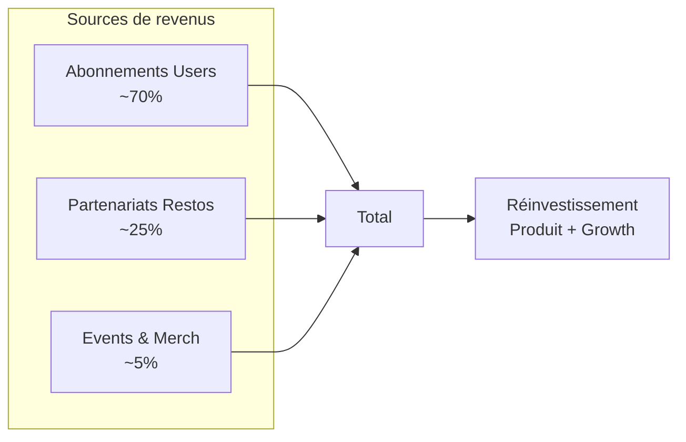

# Business Model

Huntasty adopte un modèle **zéro publicité**. Les revenus proviennent de trois sources : abonnements utilisateurs, partenariats restaurants, et événements.

## Principe fondamental

La publicité compromet la confiance dans les avis. Si un restaurant peut payer pour être mieux noté ou plus visible via des ads, le système de méritocratie s'effondre. Huntasty ne montre jamais de publicité.

Les restaurants partenaires ont une mise en avant transparente (badge visible "Partenaire Huntasty") et leur score reste 100% calculé par les avis pondérés des hunters.

## Sources de revenus

### 1. Abonnements Utilisateurs (~70% des revenus)

| Plan | Prix | Fonctionnalités |
|------|------|----------------|
| **Gratuit** | 0 | 3 quêtes/semaine, fonctions de base, carnet 6 derniers mois |
| **Huntasty Pro** | ~800 JPY/mois (~5€) | Quêtes illimitées, carnet complet, filtres avancés, mode offline, analytics perso, badge Pro |
| **Huntasty Elite** | ~2,000 JPY/mois (~13€) | Tout Pro + création events, network VIP, partenariats restos, goodies, beta features |

### 2. Partenariats Restaurants (~25% des revenus)

| Programme | Prix mensuel | Inclus |
|-----------|-------------|--------|
| **Boost Basic** | ~15,000 JPY (~99€) | Mise en avant algo, badge partenaire, analytics, support |
| **Boost Premium** | ~30,000 JPY (~199€) | + Quêtes perso, events, contact VIP, push géolocalisés |
| **Boost Elite** | ~60,000 JPY (~399€) | + Exclusivité quartier, co-création contenu, events Maître+ |

Commission sur réservations (Phase 2) : 2% via Stripe Connect.

### 3. Events & Divers (~5% des revenus)

- Entrées events premium : ~3,000-5,000 JPY
- Carnets physiques Huntasty : ~3,500 JPY
- Goodies : ~3,000 JPY/pièce

## Paiements : Stripe

Stripe est le seul choix viable pour le marché japonais :

| Besoin | Produit Stripe |
|--------|----------------|
| Abonnements users | Stripe Billing (JPY natif) |
| Abonnements restaurants | Stripe Billing (B2B invoicing) |
| Commission réservations | Stripe Connect (destination charges) |
| Tickets events | Stripe Checkout / Payment Links |
| Méthodes de paiement | Payment Element : cartes, konbini (34K+ magasins), PayPay (60M+ users) |
| Conformité fiscale | Stripe Tax (JCT) |

**Frais Stripe au Japon** : 3.6% par transaction + 0.5% pour les abonnements = ~4.1%

## KPIs & Métriques cibles

### Engagement
- **DAU/MAU ratio** : > 20%
- **Rétention J7** : > 40%
- **Hunts par user par mois** : 8+
- **Temps moyen par session** : 15 min

### Progression
- **% users Chasseur Confirmé+** : < 30% (intentionnellement difficile)
- **% hunters actifs dans un clan** : 60%
- **Ratio reviews complètes / quick snaps** : 70/30

### Business
- **Conversion gratuit → Pro** : 5%
- **LTV/CAC ratio** : > 3
- **Restaurants partenaires actifs** : croissance mensuelle
- **Revenu par restaurant partenaire** : ~30,000 JPY/mois moyen

### Qualité
- **Score moyen des reviews** : 3.8-4.2/5 (pas trop haut = crédible)
- **% reviews signalées** : < 2%
- **NPS hunters** : > 50
- **NPS restaurants** : > 40

## Coûts opérationnels estimés

### Infrastructure technique

| Poste | Coût mensuel |
|-------|-------------|
| VPS Hostinger (Asie) | ~3,000 JPY (~20€) |
| Cloudflare (gratuit + R2) | ~500 JPY (~3€) |
| Mapbox (< 50K loads) | 0 JPY |
| Resend (emails) | ~3,000 JPY (~20€) |
| Sentry (gratuit tier) | 0 JPY |
| EAS (gratuit tier) | 0 JPY |
| Domaines | ~1,500 JPY/an (~10€/an) |
| **Total technique** | **~7,000 JPY/mois (~45€)** |

### Services

| Poste | Coût mensuel |
|-------|-------------|
| Stripe (% sur transactions) | Variable |
| Apple Developer | ~15,000 JPY/an |
| Google Play Developer | ~3,800 JPY one-time |

## Projections

### Break-even estimé : 18 mois

| Mois | Users actifs | Pro (5%) | Restos partenaires | Revenu mensuel |
|------|-------------|----------|---------------------|---------------|
| 3 | 500 | 25 | 5 | ~95,000 JPY |
| 6 | 2,000 | 100 | 15 | ~530,000 JPY |
| 12 | 8,000 | 400 | 35 | ~1,870,000 JPY |
| 18 | 15,000 | 750 | 50 | **~3,100,000 JPY** |

**Seuil de rentabilité** : ~1,000 abonnés Pro + 30 restaurants partenaires ≈ 1,250,000 JPY/mois
