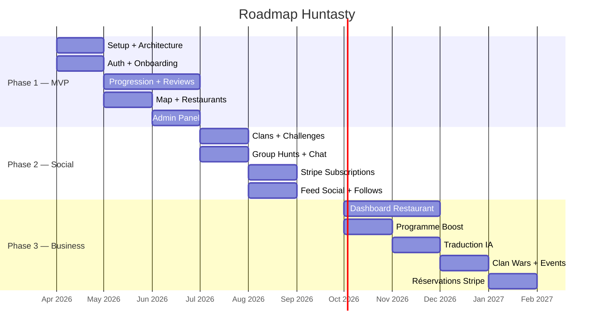

# Roadmap

## Vue d'ensemble

## Phase 1 — MVP (Mois 1-3)

**Objectif :** Application fonctionnelle avec les core features. Suffisant pour tester avec des vrais utilisateurs à Tokyo.

### Développement

| Tâche | Durée estimée |
|-------|---------------|
| Setup projet + architecture Docker | 1 semaine |
| Schema DB (Drizzle) + migrations | 1 semaine |
| Auth complète (Better Auth + onboarding) | 2 semaines |
| Système de progression (points, niveaux) | 2 semaines |
| Interface reviews (check-in + quick snap + full) | 3 semaines |
| Map + restaurants (Mapbox + import Google Places) | 2 semaines |
| Profils hunters + restaurants | 2 semaines |
| Quêtes quotidiennes basiques | 1 semaine |
| Admin panel basique (modération) | 1 semaine |

### Fonctionnalités MVP

- Inscription/connexion (email + Google + Apple)
- Système 5 niveaux hunters avec progression
- Check-in, Quick Snap, et Full Review
- Algorithme de notation pondérée
- Carte interactive (Mapbox) avec filtres basiques
- Profils hunters et restaurants
- Quêtes quotidiennes (3/semaine gratuit)
- Leaderboard local
- Notifications basiques
- Admin : modération reviews + gestion users

### Ce qui n'est PAS dans le MVP

- Clans et hunts de groupe
- Chat
- Abonnements premium (tout est gratuit en beta)
- Dashboard restaurant
- Agent de traduction IA
- Programme partenaire
- Events

## Phase 2 - Social Gaming (Mois 4-6)

**Objectif :** Engagement social et premières mécaniques de monétisation.

### Développement

| Tâche | Durée estimée |
|-------|---------------|
| Système clans complet | 3 semaines |
| Hunts de groupe + events | 2 semaines |
| Chat (clan + groupes) via WebSocket | 2 semaines |
| Leaderboards avancés + compétitions | 2 semaines |
| Intégration Stripe (abonnements users) | 2 semaines |
| Streaks + quick snap reviews | 1 semaine |
| Système follow + feed social | 2 semaines |

### Nouvelles fonctionnalités

- Clans (4-20 membres, progression clan)
- Challenges inter-clans
- Hunts de groupe ponctuels
- Système follow + feed social
- Chat clan + messages
- Hunt Streaks
- Abonnement Pro + Elite (Stripe Billing)
- Notifications push (Expo Push)

## Phase 3 - Business & Scale (Mois 7-12)

**Objectif :** Monétisation B2B, outils restaurants, et croissance.

### Développement

| Tâche | Durée estimée |
|-------|---------------|
| Dashboard restaurant pro | 4 semaines |
| Programme Boost (3 tiers) | 2 semaines |
| Analytics restaurants | 3 semaines |
| Agent de traduction IA (Gemma 3 4B) | 3 semaines |
| Clan Wars saisonnières | 2 semaines |
| Système de réservation + Stripe Connect | 3 semaines |
| Optimisations performance | Continu |

### Nouvelles fonctionnalités

- Dashboard restaurant complet (analytics, profil, team)
- Programmes Boost (Basic, Premium, Elite)
- Analytics détaillées pour restaurants
- Traduction IA des menus et reviews
- Clan Wars saisonnières
- Events premium
- Réservation via l'app + commission 2%

## Stratégie de lancement Tokyo

### Pre-launch (1 mois avant le MVP)

1. **Landing page** : huntasty.app avec early access signup
2. **Partenariats pilotes** : 15-20 restaurants à Tokyo (Shibuya, Shinjuku, Shimokitazawa)
3. **Beta hunters** : Recruter 100 beta testeurs (communauté expat + food lovers)
4. **Setup légal** : Structure juridique au Japon (KK ou GK)
5. **Import data** : Google Places pour les restaurants de Tokyo

### Soft Launch (Semaines 1-4)

1. **Event "First Hunt"** : Soirée de lancement dans un restaurant partenaire
2. **Micro-influenceurs** : 10-15 food bloggers/instagrammers Tokyo
3. **Communauté expat** : Forums, groupes Facebook/LINE des expats à Tokyo
4. **PR locale** : TimeOut Tokyo, Tokyo Cheapo, Japan Times food section
5. **Focus qualité** : Priorité = feedback utilisateurs, pas croissance

### Growth (Mois 2-6)

1. **Events hebdomadaires** : Hunts de groupe thématiques dans différents quartiers
2. **Expansion restaurants** : 50+ restaurants partenaires
3. **Programme referral** : "Invite un ami, gagnez 50 points chacun"
4. **Premiers clans** : Encourager la création de clans thématiques
5. **Premium launch** : Activation des abonnements Pro/Elite

### Scale (Mois 6+)

1. **Couverture Tokyo** : Tous les arrondissements majeurs
2. **Osaka/Kyoto** : Expansion aux autres grandes villes japonaises
3. **Paris** : Lancement du marché français
4. **Team** : Recrutement commercial + community manager
5. **Levée de fonds** (optionnel) : Seed ~50-80M JPY si accélération nécessaire

## Risques et mitigation

### Techniques

| Risque | Probabilité | Impact | Mitigation |
|--------|-------------|--------|------------|
| Surcharge serveur | Moyenne | Haut | Monitoring + scaling vertical rapide |
| Bug critique prod | Haute | Haut | Sentry + rollback Docker + hotfix OTA |
| Perte de données | Faible | Critique | Backups quotidiens + test de restauration mensuel |

### Business

| Risque | Probabilité | Impact | Mitigation |
|--------|-------------|--------|------------|
| Adoption restaurants lente | Haute | Haut | 3 mois gratuit + accompagnement personnalisé |
| Concurrence (Tabelog) | Moyenne | Moyen | Niche gamification, pas de confrontation directe |
| Rétention faible | Moyenne | Haut | Quêtes variées + social + streaks |

### Légaux

| Risque | Probabilité | Impact | Mitigation |
|--------|-------------|--------|------------|
| Non-conformité APPI | Faible | Critique | Audit légal avant lancement, privacy by design |
| Problème visa | Moyenne | Critique | Avocat immigration JP, structure juridique solide |
| Fake reviews / diffamation | Haute | Moyen | Modération proactive, CGU claires |
