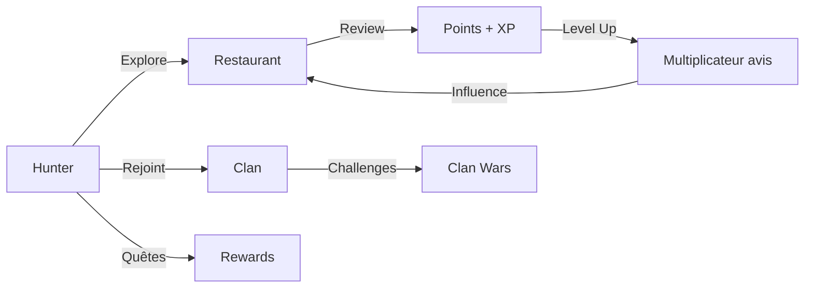

# Huntasty

**Huntasty** est une application mobile qui transforme la découverte culinaire en aventure gamifiée. Les utilisateurs deviennent des "Hunters" qui progressent en explorant des restaurants. Leurs avis ont plus d'influence selon leur expertise, et ils peuvent rejoindre des clans pour des défis collectifs.

## Vision

Créer la première plateforme mondiale de découverte culinaire où l'expertise est récompensée, la qualité prime sur la quantité, et la communauté façonne l'expérience.

### Concept en un schéma

### Différenciation

| Huntasty | Concurrence (Tabelog, TripAdvisor) |
|----------|-------------------------------------|
| Avis pondérés par expertise (x1 → x5) | Tous les avis pèsent pareil |
| Progression difficile (mois/années) | Pas de progression |
| Clans, quêtes, streaks | Pas de gamification |
| Zéro publicité | Publicités omniprésentes |
| Traduction IA des menus | Pas de traduction |
| Architecture internationale | Marché par marché |

### Marché initial

**Tokyo, Japon** — avec expansion Paris et international.

## Documentation

<Cards>
  <Card title="Spécifications Produit" href="/docs/product" icon={<svg xmlns="http://www.w3.org/2000/svg" width="24" height="24" viewBox="0 0 24 24" fill="none" stroke="currentColor" strokeWidth="2" strokeLinecap="round" strokeLinejoin="round"><circle cx="12" cy="12" r="10"/><path d="m16 12-4-4-4 4"/><path d="M12 16V8"/></svg>} />
  <Card title="Architecture Technique" href="/docs/technical" icon={<svg xmlns="http://www.w3.org/2000/svg" width="24" height="24" viewBox="0 0 24 24" fill="none" stroke="currentColor" strokeWidth="2" strokeLinecap="round" strokeLinejoin="round"><rect width="20" height="8" x="2" y="2" rx="2" ry="2"/><rect width="20" height="8" x="2" y="14" rx="2" ry="2"/><line x1="6" x2="6.01" y1="6" y2="6"/><line x1="6" x2="6.01" y1="18" y2="18"/></svg>} />
  <Card title="Business Model" href="/docs/business" icon={<svg xmlns="http://www.w3.org/2000/svg" width="24" height="24" viewBox="0 0 24 24" fill="none" stroke="currentColor" strokeWidth="2" strokeLinecap="round" strokeLinejoin="round"><path d="M16 21v-2a4 4 0 0 0-4-4H6a4 4 0 0 0-4 4v2"/><circle cx="9" cy="7" r="4"/><line x1="19" x2="19" y1="8" y2="14"/><line x1="22" x2="16" y1="11" y2="11"/></svg>} />
</Cards>
