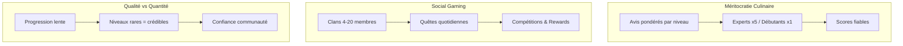
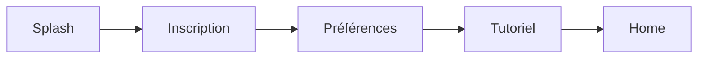

# Spécifications Produit

Huntasty repose sur trois piliers fondamentaux qui le distinguent de toute plateforme d'avis existante.

## Les trois piliers

### Pilier 1 : Méritocratie Culinaire

Contrairement à TripAdvisor ou Tabelog où tous les avis ont le même poids, Huntasty pondère les avis selon l'expertise du reviewer. Un "Génie du Palais" (niveau max, 3+ ans de progression) a un multiplicateur **x5** sur ses notes, tandis qu'un débutant a **x1**. Le score affiché d'un restaurant reflète donc l'opinion des connaisseurs, pas juste la majorité.

### Pilier 2 : Social Gaming

La découverte culinaire devient un jeu social avec des clans (groupes permanents de 4-20 membres), des quêtes quotidiennes, des streaks, des badges, et des compétitions inter-clans. L'engagement n'est pas artificiel — il est lié à de vraies expériences culinaires.

### Pilier 3 : Qualité vs Quantité

La progression est intentionnellement lente et difficile. Devenir "Chasseur Confirmé" prend environ 6 mois d'utilisation régulière. Cette difficulté garantit que les niveaux élevés sont rares et crédibles, ce qui donne de la valeur au système de pondération.

## Navigation Principale

L'app mobile utilise **5 onglets** principaux :

| Onglet | Icône | Fonction |
|--------|-------|----------|
| **Hunt** | `Crosshair` | Feed principal, quêtes actives, suggestions |
| **Map** | `Map` | Carte interactive des restaurants |
| **Carnet** | `BookOpen` | Historique personnel des hunts et reviews |
| **Social** | `Users` | Clans, groupes, feed social, leaderboards |
| **Profil** | `User` | Progression, badges, paramètres |

## Écrans MVP (35 écrans)

### Onboarding (4 écrans)

- Splash + intro concept animée
- Inscription / connexion (email + OAuth Google/Apple)
- Setup préférences (cuisines favorites, budget, régime alimentaire)
- Première mission tutoriel (guide interactif)

### Core User (15 écrans)
- Home feed avec quêtes actives et suggestions
- Map interactive avec filtres (cuisine, budget, distance, ouvert maintenant)
- Profil restaurant détaillé (infos, reviews, photos, menu traduit)
- Interface check-in / review (photo + notation + texte)
- Carnet personnel (historique, statistiques, favoris)
- Profil hunter (niveau, progression, badges, stats)
- Leaderboard local (quartier, ville, national)
- Quêtes actives et disponibles
- Notifications
- Recherche avancée
- Messages / chat (clan + group hunts)
- Paramètres (langue, notifications, confidentialité)
- Scanner QR (check-in rapide)
- Détail d'un avis (photos, likes, réponses)
- Feed social (activité des gens suivis et du clan)

### Restaurant Admin (8 écrans)
- Dashboard analytics (hunts, score, évolution)
- Gestion profil restaurant
- Notifications hunters VIP
- Programme partenaire (Boost)
- Events / invitations
- Messages hunters
- Facturation

### Admin App (8 écrans)
- Dashboard général
- Gestion utilisateurs
- Modération (reviews signalées, contenus)
- Analytics globales
- Gestion restaurants
- Système badges et quêtes
- Support
- Content management
