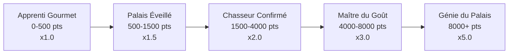

# Système de Progression

Le système de progression est le coeur de la gamification Huntasty. Il est conçu pour être **difficile** — les niveaux élevés sont rares et crédibles.

## Hiérarchie des Hunters

| Niveau | Points requis | Multiplicateur avis | Temps estimé |
|--------|---------------|---------------------|--------------|
| Apprenti Gourmet | 0 – 500 | x1.0 | Début |
| Palais Éveillé | 500 – 1,500 | x1.5 | 2-3 mois |
| Chasseur Confirmé | 1,500 – 4,000 | x2.0 | ~6 mois |
| Maître du Goût | 4,000 – 8,000 | x3.0 | ~1.5 an |
| Génie du Palais | 8,000+ | x5.0 | 3+ ans |

Le multiplicateur d'avis est la mécanique clé : il pondère l'influence de chaque review dans le calcul du score restaurant. Un Génie du Palais a **5x** plus d'impact qu'un Apprenti.

## Attribution des points

### Actions individuelles

| Action | Points | Conditions |
|--------|--------|------------|
| Check-in simple | 5 | Géolocalisation validée |
| Quick Snap Review | 5 | Photo + 3 emojis (review express 30s) |
| Review complète | 15 | Photo + 250+ caractères + notes détaillées |
| Premier découvreur | 50 | Première review d'un restaurant sur la plateforme |
| Review utile | +20 bonus | 10+ likes sur une review |

### Multiplicateurs de groupe

| Action | Points | Conditions |
|--------|--------|------------|
| Hunt groupe (2+ personnes) | x2 sur les points | GPS de tous les participants vérifié |
| Event Huntasty officiel | 100 flat | Participation à un event organisé |
| Organisateur hunt groupe | 150 flat | Créer et mener un hunt groupe |
| Hunt marathon (3+ restos/jour) | 300 flat | 3 restaurants différents en 24h |

### Limites anti-abus

<Callout type="warn">
Ces limites sont essentielles pour l'intégrité du système de progression. Sans elles, un bot pourrait atteindre Génie en quelques jours.
</Callout>

- **Cap journalier** : 500 points maximum par jour
- **Cap clan** : 500 points clan par jour
- **Cooldown** : 1 review par restaurant par 24h
- **Rate limit** : Maximum 10 reviews par jour

## Hunt Streaks

Compteur de jours consécutifs avec au moins 1 hunt.

| Streak | Badge | Bonus |
|--------|-------|-------|
| 7 jours | "Fire Hunter" | +10% points pendant le streak |
| 30 jours | "Unstoppable" | +15% points |
| 100 jours | "Legend" | +20% points |

La perte du streak remet le compteur à 0. Pas de mécanisme de "protection" — c'est intentionnellement exigeant.

## Badges

### Badges Standard (attribution automatique)

<Tabs items={["Découverte", "Expertise", "Social"]}>
  <Tab value="Découverte">
    - **Explorer** : 10 nouveaux restaurants
    - **Pioneer** : Premier à reviewer 5 lieux
    - **Globe Trotter** : 15 cuisines différentes
  </Tab>
  <Tab value="Expertise">
    - **Spécialiste [Cuisine]** : 20+ restaurants d'une même cuisine
    - **Maître Budget** : 50+ hunts sous le prix moyen local
    - **Fine Dining Expert** : 10+ restaurants gastronomiques
  </Tab>
  <Tab value="Social">
    - **Influenceur** : 100+ followers
    - **Mentor** : Aidé 10 nouveaux hunters
    - **Leader** : Organisé 5+ hunts de groupe
  </Tab>
</Tabs>

### Titres Uniques (ultra-exclusifs)

Attribution manuelle ou par la communauté. **Un seul détenteur par zone.**

- **Premier Découvreur [Quartier]** : 1 par arrondissement/quartier
- **Révélateur Talents** : Découvert 3+ restaurants devenus populaires
- **Gardien Tradition [Cuisine]** : Expert validé par les professionnels
- **Ambassadeur Culinaire** : Représente l'app dans les events

**Privilèges des titres uniques :**
- Badge ultra-distinctif dans le profil
- Avis affichés en priorité
- Invitations VIP aux events exclusifs
- Ligne directe avec l'équipe
