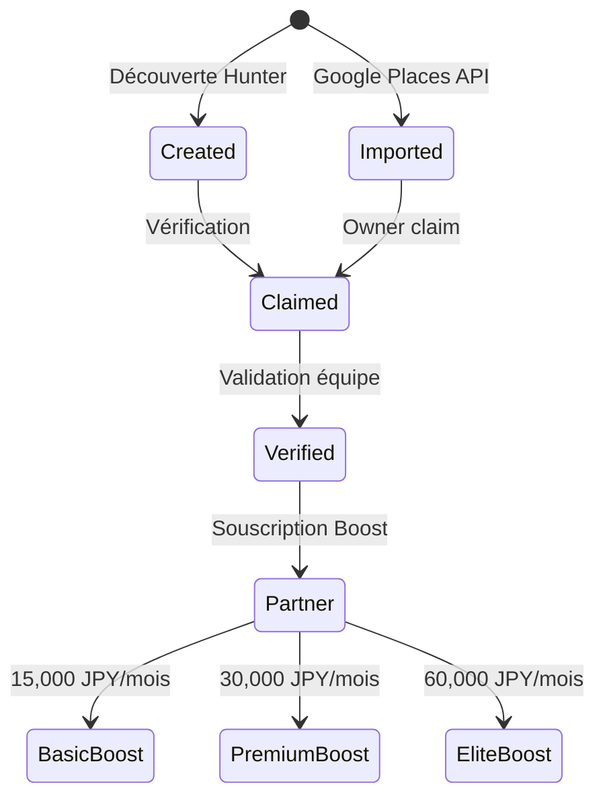

# Restaurants

Les restaurants sont à la fois le contenu et les clients B2B de Huntasty.

## Cycle de vie d'un restaurant



## Source des données restaurant

### Couche 1 : Import automatique (Google Places API)
- Import initial des restaurants de la zone de lancement (Tokyo)
- Données récupérées : nom, adresse, coordonnées GPS, horaires, catégorie cuisine, photos Google
- Statut initial : `imported`
- Ces fiches sont basiques et servent de point de départ

### Couche 2 : Démarchage partenaires
- 15-30 restaurants pilotes démarchés manuellement au lancement
- Profil complet : menu, histoire, équipe, photos pro
- Statut : `partner` avec le tier correspondant (basic/premium/elite)
- Avantage : contenu de qualité dès le lancement

### Couche 3 : Découverte communautaire
- Les hunters peuvent créer la fiche d'un restaurant non répertorié
- Fiche basique : nom, adresse, cuisine, photo
- Le restaurant peut ensuite "claim" sa fiche (vérification par téléphone/email)
- Statut : `claimed` une fois vérifié

### Cycle de vie d'un restaurant

```
imported → claimed → verified → partner (optionnel)
                                  ├── basic (99€/mois)
                                  ├── premium (199€/mois)
                                  └── elite (399€/mois)
```

## Profil Restaurant (Vue publique)

### Informations affichées
- Nom, adresse, coordonnées GPS (carte)
- Photos : extérieur, intérieur, plats (mélange pro + communauté)
- Score pondéré Huntasty (l'algorithme méritocratique)
- Scores détaillés : goût, service, ambiance, rapport qualité/prix
- Catégorie(s) cuisine, gamme de prix
- Horaires d'ouverture
- Menu traduit (via l'agent LLM pour les langues non disponibles)
- Spécialités et plats signatures
- Équipe (chef + staff, si restaurant partenaire)
- Histoire / storytelling du lieu (si partenaire)

### Reviews affichées
- Triées par pertinence (niveau hunter + récence + utilité)
- Les reviews de hunters de haut niveau sont mises en avant
- Photos des plats par la communauté
- Réponses du restaurant (si partenaire)

## Dashboard Restaurant (Vue pro)

Accessible aux `restaurant_owner` et `manager` via Better Auth Organizations.

### Analytics
- Nombre de hunts mensuel + courbe d'évolution
- Score détaillé par critère avec évolution
- Répartition des niveaux de hunters visiteurs (pie chart)
- Comparaison avec la concurrence locale (anonymisée)
- Top plats mentionnés dans les reviews
- Heures/jours de pointe des hunts

### Gestion communauté
- Répondre publiquement aux avis
- Messages privés aux hunters VIP (Maître+)
- Créer des invitations personnalisées pour des events
- Programme "Chasseur Régulier" : fidélité personnalisée

### Gestion profil
- Modifier les informations du restaurant
- Uploader photos professionnelles
- Gérer le menu (items, prix, disponibilité)
- Gérer l'équipe (inviter/retirer des membres via Better Auth)

## Programme Partenaire

### Boost Basic (99€/mois)
- Mise en avant dans les suggestions de l'algorithme
- Badge "Partenaire Huntasty" sur le profil
- Analytics détaillées
- Support prioritaire

### Boost Premium (199€/mois)
- Tout Basic +
- Création de quêtes personnalisées liées au restaurant
- Events exclusifs dans le restaurant
- Contact direct avec les hunters VIP
- Push notifications géolocalisées aux hunters proches

### Boost Elite (399€/mois)
- Tout Premium +
- Partenariat exclusif dans le quartier (1 seul Elite par zone)
- Co-création de contenu avec les hunters influents
- Events privés réservés aux hunters niveau Maître+
- Consultation stratégie par l'équipe Huntasty
