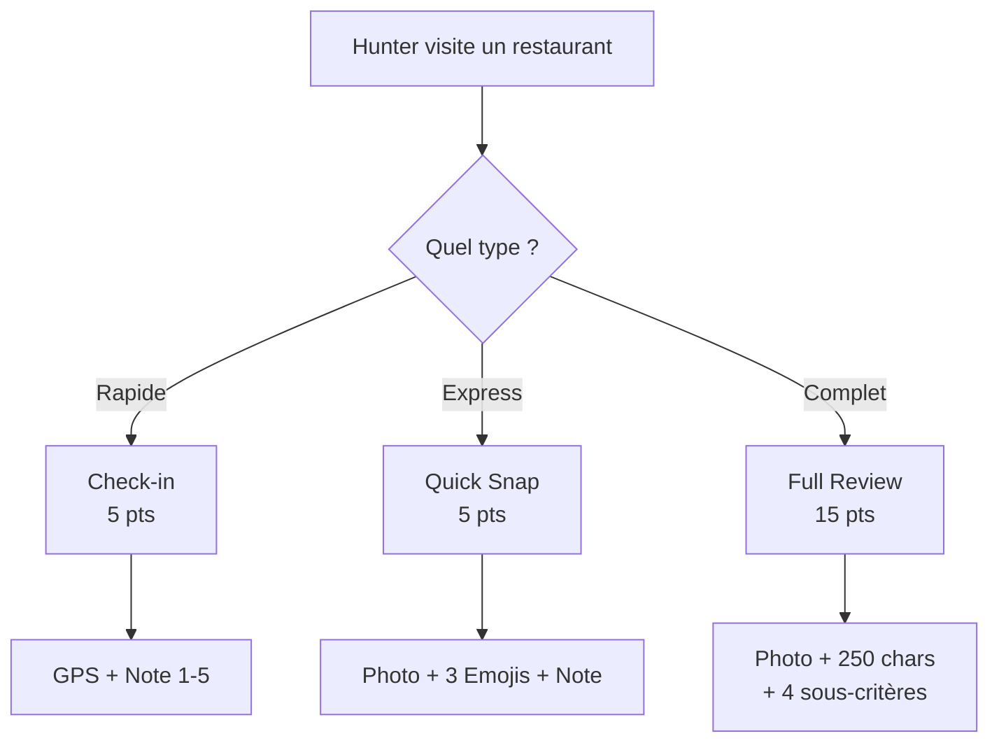

# Système de Reviews

Les reviews sont le contenu principal de Huntasty. Trois formats sont disponibles, chacun avec un niveau d'effort et de récompense différent.

## Types de reviews



<Tabs items={["Check-in", "Quick Snap", "Review Complète"]}>
  <Tab value="Check-in">
    **5 points** — Le minimum : confirmer sa présence.
    - Géolocalisation obligatoire (GPS < 100m)
    - Note globale 1-5 étoiles
    - Optionnel : une photo
  </Tab>
  <Tab value="Quick Snap">
    **5 points** — Review express en 30 secondes.
    - Photo obligatoire
    - 3 emojis de réaction
    - Note globale 1-5 étoiles
  </Tab>
  <Tab value="Review Complète">
    **15 points** — La review de référence.
    - Photo obligatoire + 3 photos optionnelles
    - Note globale 1-5 étoiles
    - 4 sous-critères : **Goût**, **Service**, **Ambiance**, **Rapport qualité/prix**
    - Description 250+ caractères minimum
    - Tags prédéfinis, prix payé, recommandé pour
  </Tab>
</Tabs>

## Algorithme de Pondération

Le score affiché d'un restaurant n'est **pas** une moyenne simple. Chaque avis est pondéré par le multiplicateur du niveau du hunter.

```ts twoslash
type HunterLevel = "apprentice" | "awakened" | "confirmed" | "master" | "genius"

const LEVEL_MULTIPLIERS: Record<HunterLevel, number> = {
  apprentice: 1.0,
  awakened: 1.5,
  confirmed: 2.0,
  master: 3.0,
  genius: 5.0,
}

function calculateWeightedScore(
  reviews: Array<{ rating: number; hunterLevel: HunterLevel }>
): number {
  let weightedSum = 0
  let totalWeight = 0

  for (const review of reviews) {
    const multiplier = LEVEL_MULTIPLIERS[review.hunterLevel]
    weightedSum += review.rating * multiplier
    totalWeight += multiplier
  }

  return totalWeight > 0 ? weightedSum / totalWeight : 0
}
```

### Exemple concret

| Hunter | Niveau | Multiplicateur | Note donnée |
|--------|--------|----------------|-------------|
| User A | Apprenti | x1.0 | 4/5 |
| User B | Apprenti | x1.0 | 4/5 |
| User C | Apprenti | x1.0 | 4/5 |
| User D | Maître | x3.0 | 3/5 |
| User E | Génie | x5.0 | 3/5 |

**Moyenne simple** : (4+4+4+3+3) / 5 = **3.6/5**

**Moyenne pondérée Huntasty** : (4×1 + 4×1 + 4×1 + 3×3 + 3×5) / (1+1+1+3+5) = **3.27/5**

<Callout type="info">
L'opinion des experts tire le score vers le bas car ils ont noté 3/5. C'est intentionnel : les connaisseurs sont plus exigeants, et leur opinion pèse plus.
</Callout>

## Contrôle Qualité

### Validation automatique

| Vérification | Action |
|--------------|--------|
| Photo floue (analyse basique) | Points réduits, warning |
| Review < 250 caractères (full review) | Rejetée, suggestion d'étoffer |
| Pattern "tout à 5/5" | Coefficient de confiance réduit |
| Incohérence GPS | Review rejetée |
| EXIF photo incohérent (date/lieu) | Flag pour modération |
| Trop de reviews en peu de temps | Rate limit + flag |

### Signalement communautaire

- Tout user peut signaler une review (fake, inappropriée, spam)
- **3 signalements** = review masquée automatiquement
- Review humaine par l'équipe modération
- Sanctions : warning → suspension temporaire → ban permanent

### Score de confiance

Chaque hunter a un score de confiance interne (non affiché) :
- Reviews cohérentes dans le temps = confiance haute
- Détection de patterns suspects = confiance réduite
- Reviews souvent signalées = confiance basse
- Reviews souvent likées = confiance haute
