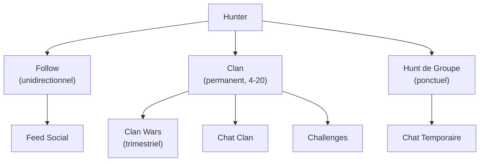

# Système Social

Le social est le second pilier de Huntasty. Il transforme la découverte culinaire solitaire en expérience collective.

## Vue d'ensemble

## Clans (Groupes Permanents)

### Règles de base
- **Taille** : 4 membres minimum, 20 maximum
- **Création** : Réservée aux Chasseurs Confirmés (niveau 3+)
- **Rejoindre** : Candidature + vote des membres existants
- **Quitter** : Libre à tout moment (cooldown 7 jours avant de rejoindre un autre clan)

### Types de clans
Les clans peuvent se spécialiser librement :
- Par cuisine : "Ramen Addicts", "Pizza Masters", "Sushi Elite"
- Par budget : "Budget Heroes", "Fine Dining Club"
- Par régime : "Green Hunters" (végé/vegan)
- Génériques : Pas de spécialisation, juste un groupe d'amis

### Progression du clan

| Niveau Clan | Condition | Avantage |
|-------------|-----------|----------|
| Rookie | Création | Fonctionnalités de base |
| Confirmed | 5,000 pts clan cumulés | Création de challenges internes |
| Elite | 20,000 pts clan cumulés | Participation aux Clan Wars |
| Legendary | 50,000 pts + victoire Clan War | Badge légendaire, events exclusifs |

### Points clan
- Les points des membres s'additionnent avec des ajustements :
  - Petits clans (4-8 membres) : **+25% bonus** (avantage underdog)
  - Gros clans (16-20 membres) : **-10% malus** (handicap d'équilibre)
- Cap : 500 points clan par jour (anti-spam)

### Fonctionnalités clan
- Chat privé permanent
- Events exclusifs au clan
- Challenges inter-clans mensuels
- Tableau de bord clan (stats, progression, classement)
- Rôles : Leader / Officier / Membre

## Clan Wars Saisonnières

Un mega-challenge inter-clans tous les 3 mois.

- **Durée** : 2 semaines
- **Format** : Classement en direct des clans participants
- **Critères** : Points accumulés pendant la période (qualité des reviews, diversité des restaurants, photos...)
- **Récompense** : Le clan gagnant remporte un dîner collectif offert dans un restaurant premium
- **Conditions** : Clan niveau Elite minimum pour participer

## Hunts de Groupe (Sorties Ponctuelles)

Sorties flexibles sans engagement permanent, ouvertes à tous.

### Création
- Titre, description, date/heure
- Nombre de participants (min 2, max configurable)
- Budget indicatif
- Restaurant cible (optionnel - peut être décidé en groupe)
- Visibilité : amis seulement OU communauté locale

### Déroulement
1. Créateur publie le hunt
2. Participants rejoignent (confirmation requise)
3. Chat temporaire pour coordination
4. Le jour J : check-in collectif au restaurant
5. Tous les participants reçoivent le multiplicateur x2
6. L'organisateur reçoit 150 points flat

### Après le hunt
- Le chat reste accessible 48h puis est archivé
- Les reviews individuelles sont marquées "Hunt de groupe"
- Les photos de groupe sont partagées

## Follows & Feed Social

### Système de follow
- Follow unidirectionnel (comme Instagram, pas comme Facebook)
- Feed personnalisé : reviews, badges, hunts des personnes suivies
- Suggestions de hunters à suivre basées sur :
  - Même ville/quartier
  - Mêmes cuisines favorites
  - Même niveau de progression

### Leaderboards
- **Local** : Classement par quartier/ville
- **National** : Top hunters du pays
- **Global** : Classement international
- **Clan** : Classement des clans
- Période : Hebdomadaire / Mensuel / All-time
