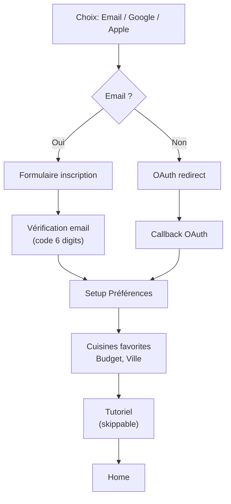
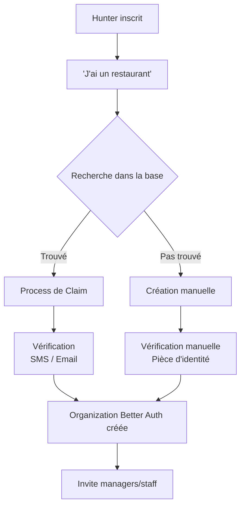
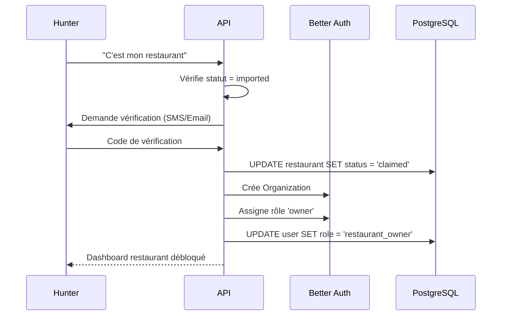

# Authentification & Rôles

Better Auth gère l'authentification, les sessions, et le multi-tenant (restaurants comme organisations).

## Méthodes d'authentification

### Email / Mot de passe
- Inscription avec vérification email obligatoire (via Resend)
- Mot de passe : minimum 8 caractères, validation côté serveur
- Récupération mot de passe par email

### OAuth (Social Login)
- **Google** : Prioritaire, fonctionne partout
- **Apple** : Obligatoire pour iOS App Store
- **LINE** (Phase 2) : Indispensable au Japon (90M+ users)

### Sessions
- Cookie-based : httpOnly, secure, sameSite=none
- Durée : 30 jours par défaut, renouvelable
- Mobile natif : Token stocké dans expo-secure-store, transmis via header Cookie

## Rôles et Permissions

### Rôles globaux (table users)

| Rôle | Description | Accès |
|------|-------------|-------|
| `hunter` | Utilisateur standard | App mobile, reviews, social |
| `restaurant_owner` | Propriétaire de restaurant | Dashboard restaurant + fonctions hunter |
| `admin` | Administrateur Huntasty | Tout accès, modération, analytics |

Un user peut être `hunter` ET `restaurant_owner` simultanément (il a les deux rôles).

### Niveaux Hunter (progression, pas un rôle auth)

Les niveaux (`apprentice`, `awakened`, `confirmed`, `master`, `genius`) ne sont **pas** des rôles d'authentification. Ils sont stockés dans le profil user et utilisés pour :
- Pondérer les avis
- Débloquer des fonctionnalités (création de clan = confirmed+)
- Calcul de points

### Rôles Restaurant (Better Auth Organizations)

Chaque restaurant est une **Organization** dans Better Auth. Les membres ont des rôles :

| Rôle | Permissions |
|------|-------------|
| `owner` | Tout : profil, analytics, équipe, facturation, réponses avis |
| `manager` | Analytics, profil, réponses avis, events |
| `staff` | Consultation analytics uniquement |

### Matrice de permissions restaurant

| Action | Owner | Manager | Staff |
|--------|-------|---------|-------|
| Voir analytics | oui | oui | oui |
| Modifier profil | oui | oui | non |
| Répondre aux avis | oui | oui | non |
| Gérer events | oui | oui | non |
| Gérer équipe | oui | non | non |
| Gérer facturation | oui | non | non |
| Modifier abonnement Boost | oui | non | non |

## Flux d'authentification

### Inscription Hunter (Mobile)

### Inscription Restaurant Owner

### Claim de restaurant

## Sécurité Auth

### Protection des sessions
- CSRF : Token synchronizer pattern
- Session fixation : Rotation du session ID après login
- Brute force : Rate limit 5 tentatives/15min par IP + par email

### Multi-device
- Un user peut avoir plusieurs sessions actives (mobile + web)
- Liste des sessions actives visible dans les paramètres
- Possibilité de révoquer une session spécifique
- "Déconnecter partout" en un clic

### APPI (Japon) & RGPD compliance
- Consentement explicite lors de l'inscription
- Politique de confidentialité en japonais et anglais
- Export des données personnelles sur demande
- Suppression du compte : soft delete (30 jours) puis hard delete
- Données de localisation : opt-in explicite, utilisées uniquement pour check-in et nearby
