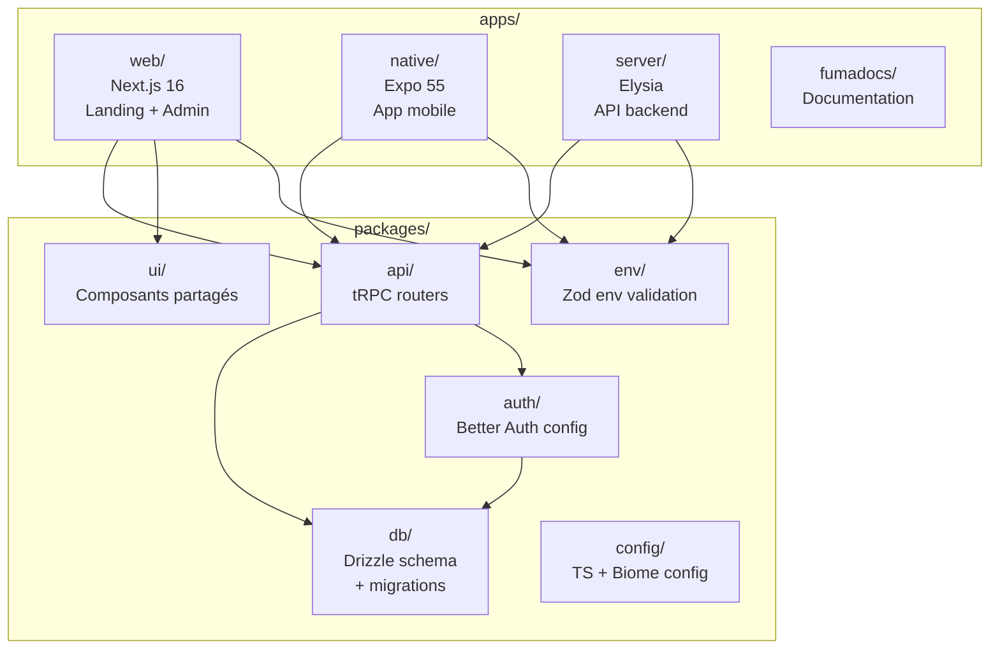
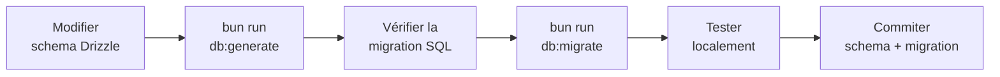

# Guide de Contribution

Bienvenue dans le projet Huntasty. Ce guide te permettra d'être opérationnel rapidement.

## Prérequis

| Outil | Version min. | Installation |
|-------|-------------|-------------|
| **Bun** | 1.3+ | [bun.sh](https://bun.sh) |
| **Docker** | 24+ | [docker.com](https://docker.com) |
| **Git** | 2.40+ | Pré-installé sur macOS/Linux |
| **VS Code** ou **Cursor** | Dernière | Recommandé |

### Extensions recommandées

- **Biome** — Lint + format (remplace ESLint + Prettier)
- **Tailwind CSS IntelliSense** — Autocompletion classes
- **Drizzle ORM** — Autocompletion SQL
- **Pretty TypeScript Errors** — Erreurs TS lisibles
- **GitLens** — Historique Git enrichi

## Setup local

### 1. Cloner et installer

```bash
git clone git@github.com:huntasty/huntasty.git
cd huntasty
bun install
```

### 2. Configurer l'environnement

```bash
cp .env.example .env
```

Remplir les variables nécessaires (cf. [Variables d'environnement](/docs/technical/conventions#variables-denvironnement)).

### 3. Lancer la base de données

```bash
bun run db:start    # Démarre PostgreSQL + Redis via Docker
bun run db:push     # Applique le schema Drizzle
```

### 4. Lancer le dev

```bash
bun run dev         # Lance tout (web + server + native)
```

Ou individuellement :

```bash
bun run dev:server  # Backend Elysia — localhost:3000
bun run dev:web     # Next.js — localhost:3001
bun run dev:native  # Expo — scan QR code
```

## Architecture du monorepo



### Où modifier quoi ?

| Je veux... | Fichier(s) | Package |
|-----------|-----------|---------|
| Ajouter une route API | `packages/api/src/routers/` | `@huntasty/api` |
| Modifier le schema DB | `packages/db/src/schema/` | `@huntasty/db` |
| Changer l'auth | `packages/auth/src/` | `@huntasty/auth` |
| Ajouter un composant web | `packages/ui/src/` | `@huntasty/ui` |
| Ajouter un écran mobile | `apps/native/app/` | `native` |
| Ajouter une page web | `apps/web/app/` | `web` |
| Configurer le backend | `apps/server/src/` | `server` |
| Modifier la doc | `apps/fumadocs/content/` | `fumadocs` |
| Ajouter une variable env | `packages/env/src/` | `@huntasty/env` |

## Workflow de développement

### 1. Créer une branche

```bash
git checkout develop
git pull origin develop
git checkout -b feat/ma-feature
```

### 2. Développer

- Écrire le code
- Le pre-commit hook (Husky + lint-staged) formate automatiquement
- Tester localement

### 3. Commiter

```bash
git add .
git commit -m "feat(scope): description du changement"
```

Les commits suivent les [conventions](/docs/technical/conventions#commits-conventionnels).

### 4. Pousser et PR

```bash
git push -u origin feat/ma-feature
```

Créer la PR vers `develop` sur GitHub. La CI vérifie automatiquement : type-check, lint, build.

### 5. Review et merge

- Attendre que la CI passe
- Review par un membre de l'équipe
- Squash merge vers `develop`
- Supprimer la branche

## Travailler sur le schema DB

Les modifications de schema suivent un processus strict pour éviter les problèmes en production.



<Callout type="warn">
Toujours commiter le fichier de migration **avec** le changement de schema. Ne jamais utiliser `db:push` en production — c'est uniquement pour le dev local.
</Callout>

### Règles DB

- **Pas de suppression de colonnes** sans migration de données
- **Pas de renommage direct** — créer la nouvelle colonne, migrer les données, supprimer l'ancienne
- **Index obligatoire** sur les colonnes utilisées en `WHERE` ou `ORDER BY`
- **Timestamps** (`createdAt`, `updatedAt`) sur toutes les tables
- **Soft delete** préféré au hard delete pour les données utilisateur

## Ajouter une route tRPC

### 1. Créer ou modifier le router

```typescript
// packages/api/src/routers/example.ts
import { protectedProcedure, router } from "../trpc"
import { z } from "zod"

export const exampleRouter = router({
  getById: protectedProcedure
    .input(z.object({ id: z.string() }))
    .query(async ({ ctx, input }) => {
      // ctx.db = Drizzle instance
      // ctx.session = session utilisateur
      return ctx.db.query.examples.findFirst({
        where: (t, { eq }) => eq(t.id, input.id),
      })
    }),
})
```

### 2. Enregistrer dans le router principal

```typescript
// packages/api/src/root.ts
import { exampleRouter } from "./routers/example"

export const appRouter = router({
  example: exampleRouter,
  // ...autres routers
})
```

### 3. Utiliser côté client

```typescript
// Le type-safety est automatique grâce à tRPC
const { data } = trpc.example.getById.useQuery({ id: "123" })
```

## Structure d'un composant React Native

```typescript
// apps/native/components/HunterCard.tsx
import { View, Text } from "react-native"
import { Image } from "expo-image"

interface HunterCardProps {
  name: string
  level: string
  avatarUrl: string
  points: number
}

export function HunterCard({ name, level, avatarUrl, points }: HunterCardProps) {
  return (
    <View>
      <Image source={{ uri: avatarUrl }} style={{ width: 48, height: 48 }} />
      <View>
        <Text>{name}</Text>
        <Text>{level} · {points} pts</Text>
      </View>
    </View>
  )
}
```

**Conventions composants mobile** :
- Un composant par fichier
- Props typées avec `interface` (pas `type`)
- `export function` (pas `export default`)
- Utiliser `expo-image` pour les images (pas `Image` de RN)
- Animations avec `react-native-reanimated` uniquement

## Debugging

### Backend

```bash
# Logs en temps réel
bun run dev:server
# Les logs LogiXlysia s'affichent dans le terminal

# Drizzle Studio (explore la DB visuellement)
bun run db:studio
```

### Mobile

```bash
# Logs Expo
bun run dev:native
# Shake le téléphone → Dev menu → Debug JS Remotely

# React DevTools
npx react-devtools
```

### Web

```bash
bun run dev:web
# React DevTools extension dans le navigateur
# Next.js DevTools : /_next/devtools
```

## FAQ

### "Le pre-commit hook échoue"

Le hook exécute `biome check`. Corriger les erreurs affichées, re-stager, et recommiter.

```bash
bun run check  # Voir et corriger les erreurs
git add .
git commit -m "..."
```

### "TypeScript me donne une erreur dans un package"

Les packages sont liés via les workspaces Bun. Si le type ne se met pas à jour :

```bash
# Relancer le serveur de types
bun run check-types
```

### "La DB locale ne démarre pas"

```bash
bun run db:stop   # Stopper les containers existants
bun run db:start  # Redémarrer
bun run db:push   # Re-pousser le schema
```

### "Comment ajouter une dépendance ?"

```bash
# Dans un package spécifique
bun add -D @types/node --filter @huntasty/api

# Dépendance partagée (catalog)
# Ajouter dans le catalog du package.json racine, puis utiliser catalog: dans le package
```
