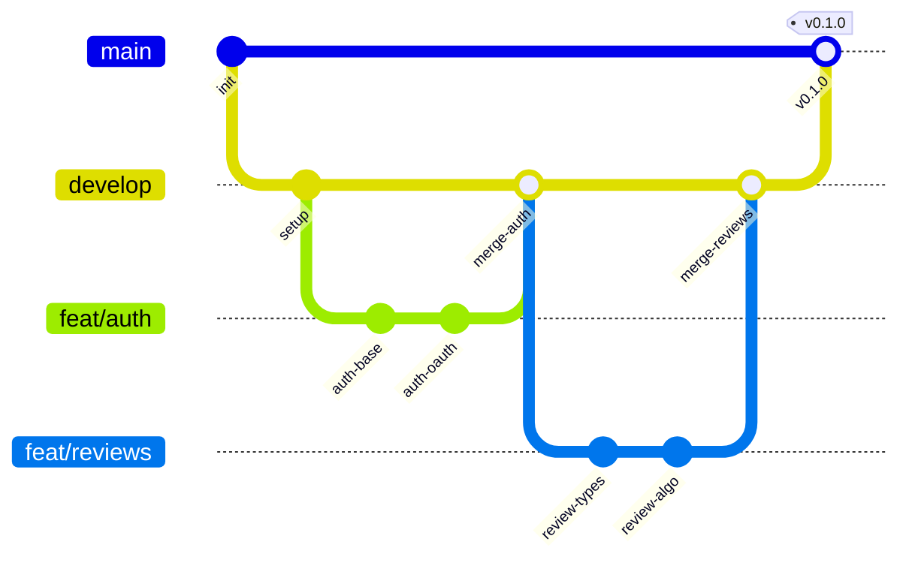

# Conventions & Workflow

## Stack & Tooling

| Outil | Rôle | Version |
|-------|------|---------|
| **Bun** | Runtime + package manager | 1.3+ |
| **Nx** | Monorepo orchestration | 22+ |
| **TypeScript** | Langage | 5+ |
| **Biome** | Lint + Format (tout-en-un) | 2.2+ |
| **Husky** | Git hooks | 9+ |
| **lint-staged** | Pre-commit automatique | 16+ |

## Conventions de code

### Formatage (Biome)

Le projet utilise **Biome** comme formateur et linter unique — pas d'ESLint, pas de Prettier.

| Règle | Valeur |
|-------|--------|
| Indentation | **Tabs** |
| Quotes | **Double quotes** (`"`) |
| Semicolons | Auto (Biome default) |
| Trailing commas | Auto (Biome default) |
| Imports | **Auto-organisés** (par Biome assist) |
| Tailwind classes | **Triées automatiquement** (`useSortedClasses`) |

### Linting strict

Les règles Biome suivantes sont activées au-delà du `recommended` par défaut :

```
style/noParameterAssign         → error
style/useAsConstAssertion       → error
style/useDefaultParameterLast   → error
style/useEnumInitializers       → error
style/useSelfClosingElements    → error
style/useSingleVarDeclarator    → error
style/noUnusedTemplateLiteral   → error
style/useNumberNamespace        → error
style/noInferrableTypes         → error
style/noUselessElse             → error
correctness/useExhaustiveDependencies → info
nursery/useSortedClasses        → warn (safe fix)
```

### Nommage

| Élément | Convention | Exemple |
|---------|-----------|---------|
| Fichiers composants | PascalCase | `HunterProfile.tsx` |
| Fichiers utilitaires | camelCase | `calculateScore.ts` |
| Fichiers de config | kebab-case | `source.config.ts` |
| Variables / fonctions | camelCase | `getWeightedScore` |
| Types / Interfaces | PascalCase | `HunterLevel` |
| Constantes | SCREAMING_SNAKE | `MAX_DAILY_POINTS` |
| Tables DB (Drizzle) | snake_case | `hunter_stats` |
| Colonnes DB | snake_case | `created_at` |
| Routes API (tRPC) | camelCase | `hunter.getProfile` |
| Dossiers | kebab-case | `group-hunt/` |

### Structure des imports

Biome organise automatiquement les imports. L'ordre conventionnel est :

```typescript
// 1. Modules Node / externes
import { Elysia } from "elysia"
import { z } from "zod"

// 2. Packages internes monorepo
import { db } from "@huntasty/db"
import { auth } from "@huntasty/auth"

// 3. Imports relatifs
import { calculateScore } from "../utils/score"
import { HunterCard } from "./HunterCard"

// 4. Types (si séparés)
import type { HunterLevel } from "@huntasty/db/schema"
```

### TypeScript

- **Strict mode** activé partout
- **Pas de `any`** — utiliser `unknown` si le type est vraiment inconnu
- **Pas de `as` casts** sauf cas justifié (et commenté)
- **Zod** pour toute validation runtime (inputs tRPC, env vars)
- **Drizzle infer** pour les types DB : `typeof users.$inferSelect`

## Workflow Git

### Branching model



| Branche | Usage | Protection |
|---------|-------|-----------|
| `main` | Production stable | Protected, merge via PR uniquement |
| `develop` | Intégration des features | Protected, merge via PR |
| `feat/*` | Nouvelle fonctionnalité | Créée depuis `develop` |
| `fix/*` | Correction de bug | Créée depuis `develop` |
| `hotfix/*` | Fix urgent en prod | Créée depuis `main`, merge dans `main` + `develop` |

### Commits conventionnels

Format : `type(scope): description`

| Type | Usage | Exemple |
|------|-------|---------|
| `feat` | Nouvelle fonctionnalité | `feat(reviews): add weighted score algorithm` |
| `fix` | Correction de bug | `fix(auth): handle expired session redirect` |
| `refactor` | Refactoring sans changement fonctionnel | `refactor(db): extract stats queries` |
| `docs` | Documentation | `docs: update API conventions` |
| `style` | Formatage (pas de changement de logique) | `style: biome format` |
| `test` | Ajout ou modification de tests | `test(reviews): add score calculation tests` |
| `chore` | Maintenance, deps, config | `chore: upgrade elysia to 1.5` |
| `ci` | CI/CD | `ci: add staging deploy workflow` |
| `perf` | Optimisation performance | `perf(api): add redis cache for leaderboard` |

**Scopes fréquents** : `auth`, `reviews`, `restaurants`, `clans`, `quests`, `social`, `db`, `api`, `web`, `native`, `infra`

### Pre-commit hook

À chaque commit, **Husky** exécute **lint-staged** qui lance `biome check --write` sur les fichiers staged :

```
*.{js,ts,cjs,mjs,d.cts,d.mts,jsx,tsx,json,jsonc}  →  biome check --write .
```

<Callout type="info">
Le hook empêche de commiter du code qui ne passe pas le linter. Si le commit échoue, corriger les erreurs et recommencer.
</Callout>

### Pull Requests

**Template PR** :

```markdown
## Quoi
<!-- Description concise du changement -->

## Pourquoi
<!-- Contexte, issue liée, motivation -->

## Comment
<!-- Approche technique, décisions, trade-offs -->

## Checklist
- [ ] Types passent (`bun run check-types`)
- [ ] Lint passe (`bun run check`)
- [ ] Tests passent (si applicable)
- [ ] Pas de console.log / debug restants
- [ ] Migration DB si changement schema
```

**Règles** :
- Toute PR doit passer la CI (type-check + lint + build)
- Review requise avant merge (quand l'équipe s'agrandit)
- Squash merge vers `develop`, merge commit vers `main`
- Supprimer la branche après merge

## GitHub Actions

### CI — `ci.yml`

```yaml
name: CI
on:
  pull_request:
    branches: [develop, main]

jobs:
  quality:
    runs-on: ubuntu-latest
    steps:
      - uses: actions/checkout@v4
      - uses: oven-sh/setup-bun@v2
      - run: bun install --frozen-lockfile

      - name: Type-check
        run: bun run check-types

      - name: Lint
        run: bun run check

      - name: Build
        run: bun run build
```

### CD — `deploy.yml`

```yaml
name: Deploy
on:
  push:
    branches: [main]

jobs:
  deploy:
    runs-on: ubuntu-latest
    steps:
      - uses: actions/checkout@v4

      - name: Build & Push Docker
        uses: docker/build-push-action@v5
        with:
          push: true
          tags: ghcr.io/huntasty/api:latest

      - name: Deploy to VPS
        uses: appleboy/ssh-action@v1
        with:
          host: ${{ secrets.VPS_HOST }}
          username: ${{ secrets.VPS_USER }}
          key: ${{ secrets.VPS_SSH_KEY }}
          script: |
            cd /opt/huntasty
            docker compose pull
            docker compose up -d
            sleep 5
            curl -f http://localhost:3000/health || docker compose rollback
```

### Mobile — `eas-update.yml`

```yaml
name: EAS Update
on:
  push:
    branches: [main]
    paths:
      - 'apps/native/**'
      - 'packages/**'

jobs:
  update:
    runs-on: ubuntu-latest
    steps:
      - uses: actions/checkout@v4
      - uses: oven-sh/setup-bun@v2
      - uses: expo/expo-github-action@v8
        with:
          eas-version: latest
          token: ${{ secrets.EXPO_TOKEN }}

      - run: bun install --frozen-lockfile
      - run: eas update --auto --non-interactive
```

## Scripts utiles

| Commande | Description |
|----------|-------------|
| `bun run dev` | Lance tous les services en dev (Nx) |
| `bun run dev:web` | Dev web uniquement |
| `bun run dev:native` | Dev mobile uniquement |
| `bun run dev:server` | Dev backend uniquement |
| `bun run build` | Build tous les packages |
| `bun run check-types` | Vérification TypeScript |
| `bun run check` | Biome lint + format (avec auto-fix) |
| `bun run db:push` | Push le schema Drizzle en DB |
| `bun run db:generate` | Générer une migration |
| `bun run db:migrate` | Appliquer les migrations |
| `bun run db:studio` | Ouvrir Drizzle Studio |
| `bun run db:start` | Démarrer PostgreSQL (Docker) |
| `bun run db:stop` | Stopper PostgreSQL |

## Variables d'environnement

Les variables sont validées au runtime via **Zod** dans le package `@huntasty/env`.

<Callout type="warn">
Ne jamais commiter de fichier `.env` dans le repo. Utiliser `.env.example` comme template.
</Callout>

### Variables requises

| Variable | Description | Où |
|----------|-------------|-----|
| `DATABASE_URL` | PostgreSQL connection string | Server |
| `REDIS_URL` | Redis connection string | Server |
| `BETTER_AUTH_SECRET` | Secret pour les sessions | Server |
| `BETTER_AUTH_URL` | URL de l'API | Server |
| `STRIPE_SECRET_KEY` | Clé secrète Stripe | Server |
| `STRIPE_WEBHOOK_SECRET` | Secret webhook Stripe | Server |
| `MAPBOX_ACCESS_TOKEN` | Token Mapbox | Client (public) |
| `CLOUDFLARE_R2_ACCESS_KEY` | Clé R2 | Server |
| `CLOUDFLARE_R2_SECRET_KEY` | Secret R2 | Server |
| `RESEND_API_KEY` | Clé Resend (emails) | Server |
| `SENTRY_DSN` | DSN Sentry | Client + Server |
| `EXPO_PUBLIC_API_URL` | URL API pour Expo | Client (public) |
