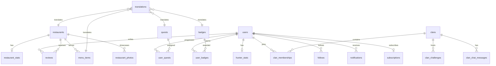
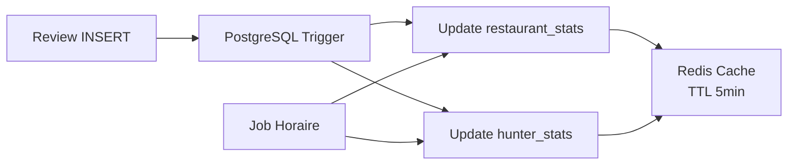

# Schema Base de Données

PostgreSQL avec l'extension PostGIS pour les requêtes géospatiales. ORM Drizzle pour le type-safety et les migrations.

## Vue d'ensemble des entités



## Tables principales

### users

```ts twoslash
// @noErrors
import { pgTable, text, integer, boolean, timestamp, date } from "drizzle-orm/pg-core"

export const users = pgTable("users", {
  id: text("id").primaryKey(),
  username: text("username").unique().notNull(),
  displayName: text("display_name").notNull(),
  avatarUrl: text("avatar_url"),
  locale: text("locale").default("ja"),
  countryCode: text("country_code").default("JP"),
  city: text("city"),
  role: text("role").default("hunter"),
  //    ^?
  level: text("level").default("apprentice"),
  //     ^?
  totalPoints: integer("total_points").default(0),
  currentStreak: integer("current_streak").default(0),
  longestStreak: integer("longest_streak").default(0),
  lastHuntDate: date("last_hunt_date"),
  isPro: boolean("is_pro").default(false),
  stripeCustomerId: text("stripe_customer_id"),
  createdAt: timestamp("created_at").defaultNow(),
  updatedAt: timestamp("updated_at").defaultNow(),
})
```

### restaurants

```ts twoslash
// @noErrors
import { pgTable, text, doublePrecision, smallint, timestamp } from "drizzle-orm/pg-core"

export const restaurants = pgTable("restaurants", {
  id: text("id").primaryKey(),
  googlePlaceId: text("google_place_id").unique(),
  slug: text("slug").unique().notNull(),
  originalLocale: text("original_locale").default("ja"),
  address: text("address").notNull(),
  city: text("city").notNull(),
  countryCode: text("country_code").default("JP").notNull(),
  prefecture: text("prefecture"),
  postalCode: text("postal_code"),
  latitude: doublePrecision("latitude").notNull(),
  longitude: doublePrecision("longitude").notNull(),
  cuisineTypes: text("cuisine_types").array(),
  priceRange: smallint("price_range"),
  phone: text("phone"),
  website: text("website"),
  openingHours: text("opening_hours"), // JSONB en pratique
  status: text("status").default("imported"),
  //      ^?
  partnerTier: text("partner_tier"),
  //           ^?
  claimedBy: text("claimed_by"),
  createdAt: timestamp("created_at").defaultNow(),
  updatedAt: timestamp("updated_at").defaultNow(),
})
```

### translations (architecture internationale)

<Callout type="info">
La table `translations` est le pilier de l'internationalisation. Elle permet de traduire n'importe quel champ de n'importe quelle entité dans n'importe quelle langue, sans modifier le schema.
</Callout>

```ts twoslash
// @noErrors
import { pgTable, text, real, timestamp, uniqueIndex } from "drizzle-orm/pg-core"

export const translations = pgTable("translations", {
  id: text("id").primaryKey(),
  entityType: text("entity_type").notNull(),
  //          ^?
  entityId: text("entity_id").notNull(),
  field: text("field").notNull(),
  //     ^?
  locale: text("locale").notNull(),
  content: text("content").notNull(),
  source: text("source").default("original"),
  //      ^?
  confidenceScore: real("confidence_score"),
  createdAt: timestamp("created_at").defaultNow(),
  updatedAt: timestamp("updated_at").defaultNow(),
})
// UNIQUE constraint: (entity_type, entity_id, field, locale)
```

### reviews

```ts twoslash
// @noErrors
import { pgTable, text, smallint, integer, boolean, timestamp } from "drizzle-orm/pg-core"

export const reviews = pgTable("reviews", {
  id: text("id").primaryKey(),
  userId: text("user_id").notNull(),
  restaurantId: text("restaurant_id").notNull(),
  type: text("type").notNull(),
  //    ^?
  rating: smallint("rating").notNull(),
  tasteRating: smallint("taste_rating"),
  serviceRating: smallint("service_rating"),
  ambianceRating: smallint("ambiance_rating"),
  valueRating: smallint("value_rating"),
  content: text("content"),
  pricePaid: integer("price_paid"),
  currency: text("currency").default("JPY"),
  recommendedFor: text("recommended_for").array(),
  tags: text("tags").array(),
  isFirstDiscoverer: boolean("is_first_discoverer").default(false),
  pointsEarned: integer("points_earned").default(0),
  likesCount: integer("likes_count").default(0),
  reportsCount: integer("reports_count").default(0),
  isHidden: boolean("is_hidden").default(false),
  hunterLevelAtTime: text("hunter_level_at_time").notNull(),
  groupHuntId: text("group_hunt_id"),
  createdAt: timestamp("created_at").defaultNow(),
  updatedAt: timestamp("updated_at").defaultNow(),
})
```

### clans

```ts twoslash
// @noErrors
import { pgTable, text, integer, smallint, timestamp } from "drizzle-orm/pg-core"

export const clans = pgTable("clans", {
  id: text("id").primaryKey(),
  slug: text("slug").unique().notNull(),
  avatarUrl: text("avatar_url"),
  cuisineSpecialty: text("cuisine_specialty"),
  level: text("level").default("rookie"),
  //     ^?
  totalPoints: integer("total_points").default(0),
  memberCount: integer("member_count").default(0),
  maxMembers: smallint("max_members").default(20),
  minHunterLevel: text("min_hunter_level").default("apprentice"),
  createdBy: text("created_by").notNull(),
  createdAt: timestamp("created_at").defaultNow(),
  updatedAt: timestamp("updated_at").defaultNow(),
})
// name & description via translations table
```

### menu_items

```ts twoslash
// @noErrors
import { pgTable, text, integer, boolean, smallint, timestamp } from "drizzle-orm/pg-core"

export const menuItems = pgTable("menu_items", {
  id: text("id").primaryKey(),
  restaurantId: text("restaurant_id").notNull(),
  category: text("category"),
  price: integer("price"),
  currency: text("currency").default("JPY"),
  isAvailable: boolean("is_available").default(true),
  allergens: text("allergens").array(),
  photoUrl: text("photo_url"),
  sortOrder: smallint("sort_order").default(0),
  createdAt: timestamp("created_at").defaultNow(),
  updatedAt: timestamp("updated_at").defaultNow(),
})
// name & description via translations table
```

## Stratégie de dénormalisation



Les tables `hunter_stats` et `restaurant_stats` sont des **vues matérialisées manuelles** mises à jour par :

1. **Triggers PostgreSQL** : Sur INSERT/UPDATE de reviews, recalcul incrémental
2. **Jobs périodiques** : Recalcul complet toutes les heures (filet de sécurité)
3. **Cache Redis** : Stats cachées avec TTL de 5 min pour les hot paths

## Index spatiaux

<Tabs items={["MVP (Bounding Box)", "Phase 2 (PostGIS)"]}>
  <Tab value="MVP (Bounding Box)">
    ```sql
    CREATE INDEX idx_restaurants_geo
      ON restaurants (latitude, longitude);

    -- Query: restaurants dans un rayon
    SELECT * FROM restaurants
    WHERE latitude BETWEEN $1 AND $2
      AND longitude BETWEEN $3 AND $4;
    ```
    Simple, suffisant pour les premiers 10K restaurants.
  </Tab>
  <Tab value="Phase 2 (PostGIS)">
    ```sql
    ALTER TABLE restaurants
      ADD COLUMN geom GEOMETRY(Point, 4326);

    CREATE INDEX idx_restaurants_geom
      ON restaurants USING GIST(geom);

    -- Query: restaurants dans 1km
    SELECT * FROM restaurants
    WHERE ST_DWithin(
      geom,
      ST_MakePoint($1, $2)::geography,
      1000
    );
    ```
    Précis pour les calculs de distance, nécessite PostGIS.
  </Tab>
</Tabs>
