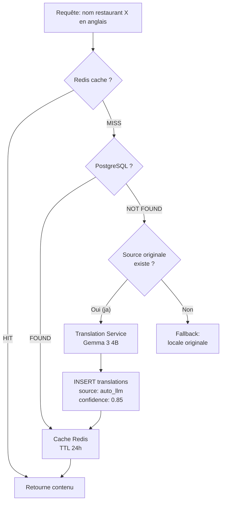

# Internationalisation (i18n)

Huntasty est conçu pour être international dès le départ. L'architecture de traduction supporte un nombre illimité de langues sans modification du schema.

## Langues prioritaires

| Priorité | Langue | Code | Marché |
|----------|--------|------|--------|
| 1 | Japonais | `ja` | Lancement Tokyo |
| 2 | Anglais | `en` | International / touristes |
| 3 | Français | `fr` | Paris / expansion |
| 4 | Coréen | `ko` | Phase 2 (Séoul) |
| 5 | Chinois simplifié | `zh` | Phase 2 (touristes) |

## Architecture de traduction

### Trois couches de contenu à traduire

**1. Interface utilisateur (UI strings)**
Géré par les bibliothèques i18n standard :
- **Web** : `next-intl` ou `react-i18next`
- **Mobile** : `expo-localization` + `i18next`
- Fichiers JSON par locale : `locales/ja.json`, `locales/en.json`
- Détection automatique de la langue du device

**2. Contenu structuré (DB)**
Géré par la table `translations` :
- Noms et descriptions de restaurants
- Items de menu
- Noms et descriptions de quêtes
- Noms et descriptions de badges
- Titres de hunts de groupe

**3. Contenu utilisateur (reviews)**
Géré par l'agent de traduction IA :
- Les reviews restent dans leur langue originale
- Traduction à la demande quand un user consulte dans une autre langue
- Résumés traduits pour les reviews longues

### Table translations — Fonctionnement



### Logique de fallback

Si une traduction n'existe pas pour la locale demandée :
1. Chercher la traduction dans la locale demandée
2. Si absent : chercher en anglais (langue pivot)
3. Si absent : retourner dans la locale originale de l'entité
4. Afficher un indicateur "non traduit" côté UI

## Agent de Traduction IA

### Architecture

```
Translation Service (micro-service Docker)
├── API HTTP interne (pas exposé publiquement)
├── Queue de traduction (Redis-based)
├── Modèle : Gemma 3 4B (self-hosted)
│   ├── VRAM : ~3GB (GPU) ou CPU mode (plus lent)
│   ├── Spécialisé vocabulaire food/restaurant
│   └── Prompt engineering pour la qualité
├── Cache résultats → PostgreSQL + Redis
└── Monitoring : temps de réponse, confidence scores
```

### Prompt engineering

Le modèle reçoit un prompt contextualisé :

```
Tu es un traducteur spécialisé dans la gastronomie et la restauration.
Traduis le texte suivant de {source_locale} vers {target_locale}.

Contexte : {entity_type} (ex: nom de restaurant, description de plat, review)
Pays d'origine : {country_code}
Cuisine : {cuisine_type}

Règles :
- Conserve les noms propres (noms de plats traditionnels, noms de rues)
- Ajoute la romanisation entre parenthèses pour les termes japonais/coréens/chinois
- Adapte les unités (yen → indication en devise locale si pertinent)
- Garde le ton et le style du texte original
- Pour les menus : sois précis sur les ingrédients

Texte source : {content}
```

### Cas d'usage prioritaires

**Menu Translation (killer feature)**
Un touriste français à Tokyo ouvre la carte d'un izakaya :
- Menu original en japonais
- L'app affiche automatiquement en français
- Noms de plats : traduction + romanisation ("Karaage (唐揚げ) - Poulet frit japonais")
- Descriptions : ingrédients et préparation traduits
- Allergènes : traduits avec les conventions locales

**Review Translation**
Un hunter japonais a écrit une review en japonais. Un user anglais la consulte :
- Résumé traduit affiché par défaut
- Option "Voir l'original" disponible
- Indication : "Traduit automatiquement"

**Quest Translation**
Les quêtes sont créées par l'équipe Huntasty :
- Rédigées en japonais et anglais manuellement
- Autres langues : traduction automatique + vérification

### Qualité et vérification

| Confidence Score | Action |
|-----------------|--------|
| > 0.9 | Publication directe |
| 0.7 - 0.9 | Publication avec tag "traduction auto" |
| < 0.7 | Flag pour review humaine |

La communauté peut signaler les traductions incorrectes → correction manuelle → source passe à "verified".

### Coût estimé

Le modèle est self-hosted, donc le coût est uniquement le compute :
- Gemma 3 4B sur GPU (NVIDIA T4 par ex) : ~50ms par traduction
- Sur CPU : ~500ms par traduction
- Avec cache Redis : 95%+ des requêtes sont servies sans appel au modèle
- Coût réel : inclus dans le VPS (pas de coût par requête)

### Fallback externe

Si le modèle local ne supporte pas une langue ou si la qualité est insuffisante :
- DeepL API : meilleure qualité, $25/mois pour 500K caractères
- Google Cloud Translation : fallback universel
- Le fallback est transparent pour l'utilisateur

## Devises et fuseaux horaires

### Devises
- Chaque restaurant a une `currency` (JPY, EUR, USD, etc.)
- Les prix dans `menu_items` et `reviews.price_paid` sont stockés en plus petite unité (yen, centimes)
- L'affichage est formaté côté client selon la locale (`Intl.NumberFormat`)
- Pas de conversion de devises (les prix sont affichés dans la devise du restaurant)

### Fuseaux horaires
- Les dates sont stockées en UTC (TIMESTAMPTZ)
- Les horaires d'ouverture des restaurants sont en heure locale
- L'affichage est converti côté client selon le fuseau de l'utilisateur
- Les quêtes daily se réinitialisent à minuit heure locale du hunter
