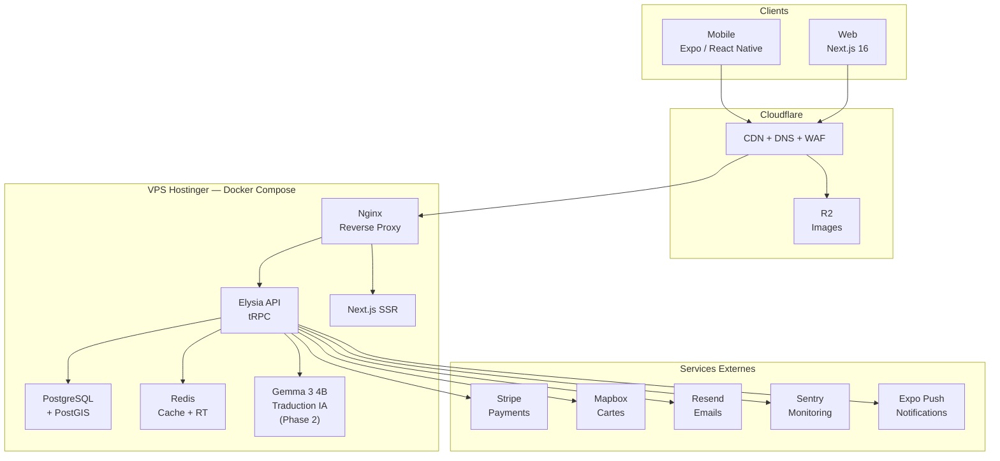
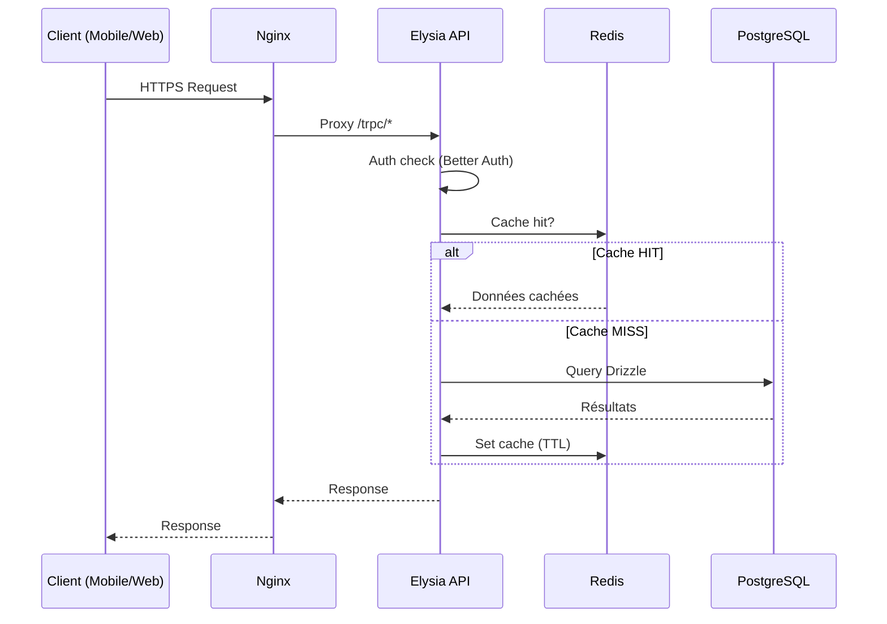

# Architecture Technique

## Principes directeurs

1. **International dès le départ** : Toute donnée textuelle est traduisible, les devises et fuseaux horaires sont gérés par entité
2. **Type-safety end-to-end** : Du schema DB jusqu'au composant React Native, tout est typé
3. **Performance mobile-first** : Chaque décision est évaluée par son impact sur l'expérience mobile
4. **Self-hosted quand possible** : Contrôle total sur les données et les coûts
5. **Progression, pas perfection** : Le MVP est fonctionnel et solide, les optimisations arrivent itérativement

## Architecture globale



## Stack Technique

### Runtime & Build

| Composant | Technologie | Justification |
|-----------|-------------|---------------|
| Runtime | **Bun** 1.3+ | Performance, compatibilité npm, runtime unifié |
| Monorepo | **Nx** 22+ | Task graph, affected, caching intelligent |
| Language | **TypeScript** 5+ | Type-safety, DX, écosystème |
| Linting | **Biome** 2.2+ | Rapide, tout-en-un (lint + format) |

### Backend

| Composant | Technologie | Justification |
|-----------|-------------|---------------|
| API Framework | **Elysia** | Performant sur Bun, type-safe, middleware riche |
| API Protocol | **tRPC** | Type-safety client-serveur, pas de codegen |
| Database | **PostgreSQL** + PostGIS | Relationnel, geo-queries, JSONB, mature |
| ORM | **Drizzle** | Performant, migrations, type-safe |
| Cache | **Redis** | Leaderboards, sessions, rate limiting, cache traductions |
| Auth | **Better Auth** | Organizations (multi-tenant restaurants), rôles granulaires |
| Logging | **LogiXlysia** | Logging structuré Pino pour Elysia, file rotation, custom format |

### Frontend Mobile

| Composant | Technologie | Justification |
|-----------|-------------|---------------|
| Framework | **Expo** 55 | Accès natif, OTA updates, build service (EAS) |
| Runtime | **React Native** 0.83 | Natif iOS/Android |
| Navigation | **Expo Router** | File-based routing, typed routes |
| Styling | **Unistyles** 3 | Theming natif performant, dark mode |
| Animations | **Reanimated** 4 | Animations UI thread (60fps) |
| Lists | **FlashList** | Listes virtualisées performantes |
| Local DB | **expo-sqlite** | Cache offline |

### Frontend Web

| Composant | Technologie | Justification |
|-----------|-------------|---------------|
| Framework | **Next.js** 16 | SSR/SSG, React Server Components |
| React | **React** 19 | Compiler, Server Components |
| Styling | **Tailwind CSS** 4 | Utility-first, design system cohérent |
| State | **React Query** | Cache serveur, optimistic updates |
| Forms | **TanStack Form** + Zod | Validation type-safe |
| UI Primitives | **Radix UI** | Accessibilité, headless, styling custom |

### Services Externes

| Service | Usage | Coût estimé |
|---------|-------|-------------|
| **Stripe** | Payments (Billing + Connect) | 3.6% + 0.5% / transaction |
| **Mapbox** | Cartes interactives | Gratuit < 50K loads/mois |
| **Cloudflare R2** | Stockage images | $0.015/GB, 0 egress |
| **Cloudflare CDN** | CDN global + DNS + SSL | Gratuit |
| **Resend** | Emails transactionnels | 100/jour gratuit |
| **Sentry** | Error tracking | Gratuit tier dev |
| **Expo EAS** | Builds mobile + OTA | Gratuit (30 builds/mois) |

## Architecture Monorepo

```
Huntasty/
├── apps/
│   ├── web/          # Next.js — Landing, admin, dashboard restaurant
│   ├── native/       # Expo — App mobile iOS/Android
│   ├── server/       # Elysia — API backend
│   └── fumadocs/     # Documentation technique
│
├── packages/
│   ├── api/          # tRPC routers et procedures
│   ├── auth/         # Better Auth configuration
│   ├── db/           # Drizzle schema, migrations, queries
│   ├── env/          # Validation variables d'environnement
│   ├── ui/           # Composants UI partagés (web)
│   └── config/       # Config TypeScript et Biome partagée
│
└── tooling/
    └── docker/       # Docker Compose, Dockerfiles, scripts
```

## Flux de données


