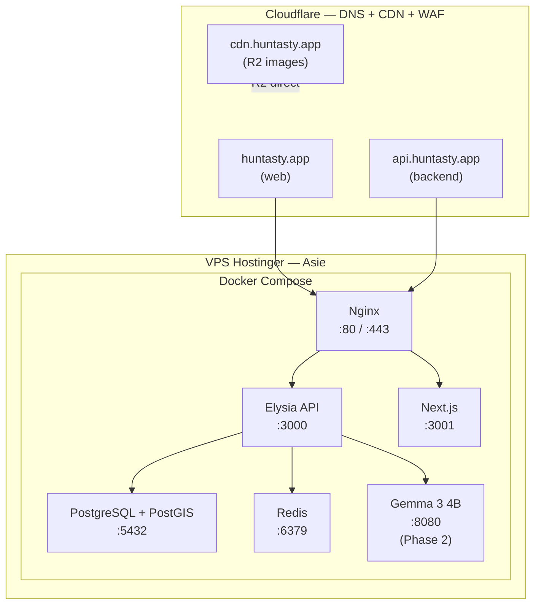
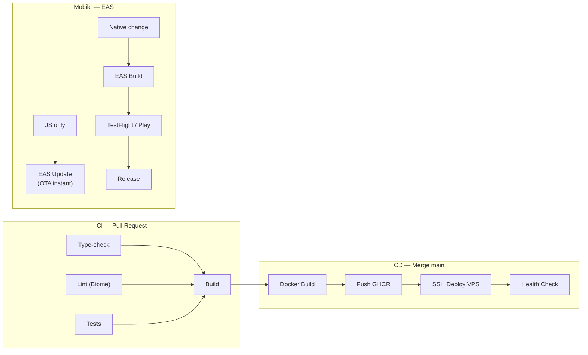
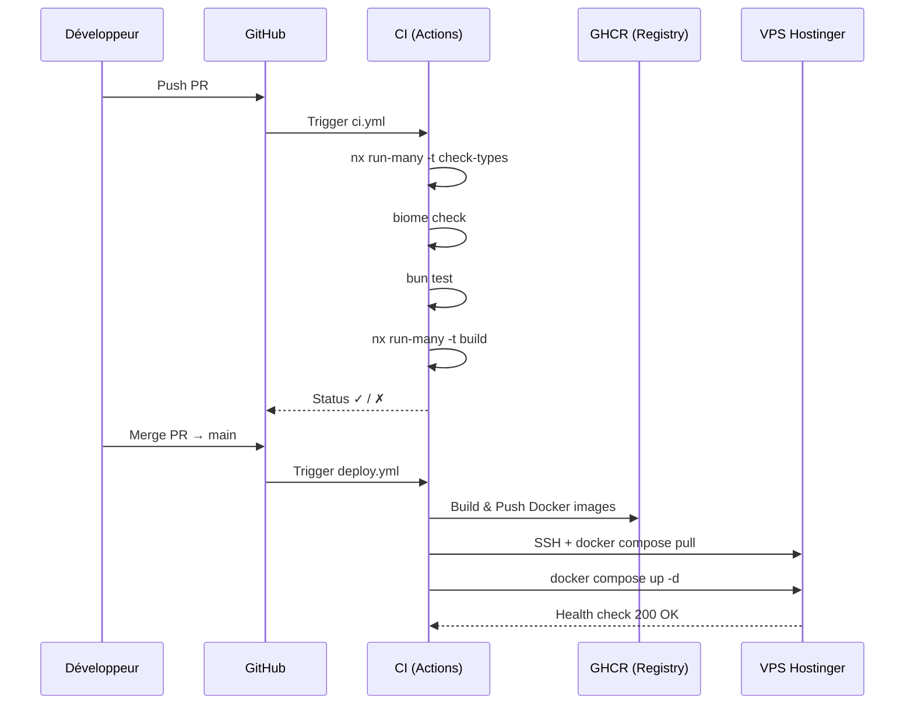

# Infrastructure & Déploiement

## Architecture de production



## Docker Compose

### Services

| Service | Image | Port | Volume |
|---------|-------|------|--------|
| `nginx` | nginx:alpine | 80, 443 | certs, config |
| `api` | Custom (Elysia + Bun) | 3000 | - |
| `web` | Custom (Next.js) | 3001 | - |
| `postgres` | postgis/postgis:16 | 5432 | postgres_data |
| `redis` | redis:7-alpine | 6379 | redis_data |
| `translation` (Phase 2) | Custom (Gemma 3) | 8080 | model_cache |

### Dockerfile Backend (multi-stage)

```dockerfile
# Stage 1: Install dependencies
FROM oven/bun:1 AS deps
WORKDIR /app
COPY package.json bun.lock ./
COPY packages/ ./packages/
COPY apps/server/package.json ./apps/server/
RUN bun install --frozen-lockfile

# Stage 2: Build
FROM oven/bun:1 AS builder
WORKDIR /app
COPY --from=deps /app/node_modules ./node_modules
COPY . .
RUN bun run build --filter=server

# Stage 3: Production
FROM oven/bun:1-slim AS runner
WORKDIR /app
COPY --from=builder /app/apps/server/dist ./
COPY --from=builder /app/node_modules ./node_modules
EXPOSE 3000
CMD ["bun", "run", "index.mjs"]
```

### Volumes persistants

```yaml
volumes:
  postgres_data:     # Données PostgreSQL
  redis_data:        # Données Redis (persistance AOF)
  backups:           # Sauvegardes automatisées
  ssl_certs:         # Certificats Let's Encrypt
```

## CI/CD Pipeline



### GitHub Actions



### Stratégie de déploiement

**Backend + Web** :
1. PR merge → main
2. GitHub Actions build les images Docker
3. Push vers GitHub Container Registry (GHCR)
4. SSH vers le VPS
5. `docker compose pull && docker compose up -d`
6. Health check : `GET /health` → 200 OK
7. Si échec : rollback automatique vers l'image précédente

**Mobile (Expo/EAS)** :
1. Changements JS seulement → EAS Update (OTA, instantané)
2. Changements natifs → EAS Build → TestFlight/Play Internal → Review → Release
3. Versioning semver : `major.minor.patch`

### Environnements

| Environnement | Usage | URL |
|---------------|-------|-----|
| `development` | Local, chaque développeur | localhost:3000/3001 |
| `staging` | Tests avant production | staging.huntasty.app |
| `production` | Utilisateurs finaux | huntasty.app |

## Monitoring

### Logging — LogiXlysia

Logging structuré via [LogiXlysia](https://logixlysia.vercel.app/), un middleware Elysia basé sur Pino.

```ts twoslash
// @noErrors
import { Elysia } from "elysia"
import logixlysia from "logixlysia"

const app = new Elysia()
  .use(
    logixlysia({
      config: {
        showStartupMessage: true,
        startupMessageFormat: "banner",
        timestamp: {
          translateTime: "yyyy-mm-dd HH:MM:ss.SSS",
        },
        logFilePath: "./logs/huntasty.log",
        ip: true,
        customLogFormat:
          "{now} {level} {duration} {method} {pathname} {status} {message} {ip}",
      },
    })
  )
```

**Fonctionnalités :**
- Logging structuré JSON (Pino) pour chaque requête HTTP
- Rotation automatique des fichiers de log (taille/temps)
- Capture : méthode, path, status, durée, IP client
- Méthodes custom : `info`, `warn`, `error`, `debug`
- Compatible avec des transports externes (Elasticsearch, Loki)

### Sentry (erreurs)
- SDK intégré dans : backend (Elysia), web (Next.js), mobile (Expo)
- Source maps uploadés pour le debugging
- Alertes email sur les erreurs critiques
- Performance monitoring : temps de réponse API

### Uptime monitoring
- Uptime Robot (gratuit) : ping /health toutes les 5 minutes
- Alertes : email + webhook Discord/Slack
- Endpoints surveillés :
  - `api.huntasty.app/health`
  - `huntasty.app`

### Backups

```bash
# backup.sh - Exécuté quotidiennement via cron
#!/bin/bash
TIMESTAMP=$(date +%Y%m%d_%H%M%S)
BACKUP_DIR="/backups"

# PostgreSQL dump
docker exec postgres pg_dump -U postgres Huntasty | gzip > "$BACKUP_DIR/db_$TIMESTAMP.sql.gz"

# Rétention : garder 30 jours
find "$BACKUP_DIR" -name "db_*.sql.gz" -mtime +30 -delete

# Upload vers stockage externe (R2 ou autre)
# rclone copy "$BACKUP_DIR/db_$TIMESTAMP.sql.gz" r2:huntasty-backups/
```

- Fréquence : quotidienne (minuit UTC)
- Rétention : 30 jours local, 90 jours stockage externe
- Test de restauration : mensuel

## Domaines et DNS

| Domaine | Usage | Pointage |
|---------|-------|----------|
| `huntasty.app` | Site web + landing | Cloudflare → VPS |
| `api.huntasty.app` | API backend | Cloudflare → VPS |
| `cdn.huntasty.app` | Images (R2) | Cloudflare R2 |
| `docs.huntasty.app` | Documentation | Cloudflare → VPS |

### SSL/TLS
- **Option 1** : Cloudflare Full (Strict) - SSL terminé par Cloudflare
- **Option 2** : Let's Encrypt via Nginx (certbot auto-renewal)
- Recommandé : Cloudflare Full pour la simplicité et la performance

## Scaling (quand le besoin se présente)

### Vertical (immédiat)
- Upgrader le VPS Hostinger (plus de RAM/CPU)
- Suffisant jusqu'à ~10K users actifs

### Horizontal (Phase 3+)
- Séparer PostgreSQL sur un VPS dédié
- Ajouter un second VPS pour l'API (load balancer Nginx)
- Redis Sentinel pour la haute disponibilité
- Envisager un managed PostgreSQL (Neon, Supabase) si la maintenance devient un problème

Le scaling prématuré est l'ennemi. Un VPS correctement configuré tient largement les premiers 10K-50K users.
