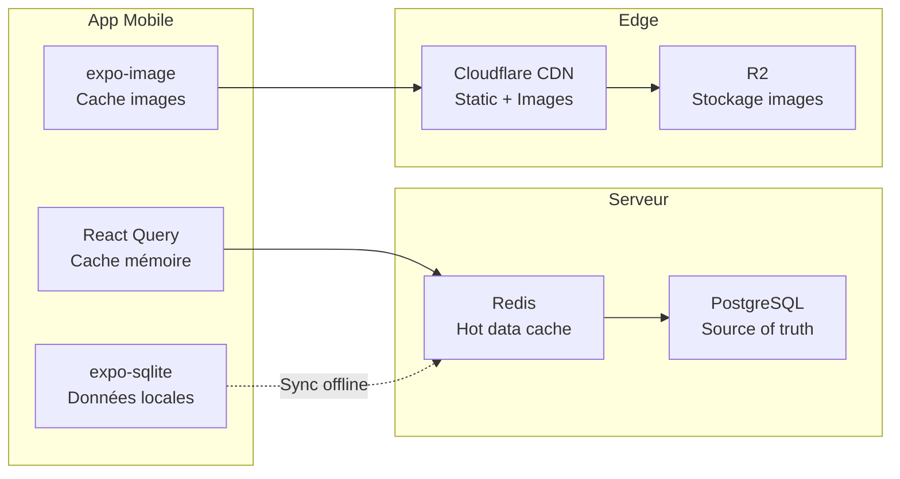

# Performance & Offline

L'expérience mobile est la priorité absolue. Chaque décision technique est évaluée par son impact sur la fluidité de l'app.

## Stratégie de cache multi-couches



## Stratégie Offline

### Données cachées localement (expo-sqlite)

| Donnée | Durée de cache | Mise à jour |
|--------|---------------|-------------|
| Profil hunter + stats | Permanent | Sync à chaque ouverture |
| Badges obtenus | Permanent | Sync à chaque ouverture |
| Restaurants favoris | Permanent | Sync toutes les heures |
| Restaurants récemment consultés | 7 jours | Auto |
| Reviews brouillons | Jusqu'à sync | Upload à la reconnexion |
| Quêtes actives + progression | 24h | Sync toutes les heures |
| Map tiles (quartier de l'user) | 7 jours | Mapbox offline packs |

### Queue d'actions offline

Quand l'utilisateur est hors-ligne, les actions sont stockées localement et synchronisées à la reconnexion.

**Actions supportées offline :**
- Rédiger une review (brouillon)
- Prendre des photos de plats
- Liker une review (depuis le cache)
- Mettre un restaurant en favori

**Actions nécessitant le réseau :**
- Publier une review (vérification GPS serveur)
- Check-in (vérification géolocalisation)
- Chat clan
- Paiements

**Résolution de conflits :** Server-wins. En cas de divergence entre les données locales et le serveur, le serveur fait autorité. L'utilisateur est notifié si une action offline a été rejetée.

### Feedback UI offline

- Indicateur discret "Hors ligne" dans la top bar
- Actions possibles : badge vert "Disponible hors ligne"
- Actions impossibles : grisées avec tooltip "Nécessite une connexion"
- Sync en cours : spinner discret + "Synchronisation..."
- Sync terminée : toast "Données à jour"

## Cache Strategy (React Query)

### Configuration par type de données

```typescript
// Données qui changent rarement
const PROFILE_QUERY_OPTIONS = {
  staleTime: 5 * 60 * 1000,     // 5 minutes
  gcTime: 30 * 60 * 1000,       // 30 minutes
};

// Données fréquemment consultées
const RESTAURANT_QUERY_OPTIONS = {
  staleTime: 60 * 60 * 1000,    // 1 heure
  gcTime: 24 * 60 * 60 * 1000,  // 24 heures
};

// Données temps réel
const FEED_QUERY_OPTIONS = {
  staleTime: 30 * 1000,          // 30 secondes
  gcTime: 5 * 60 * 1000,         // 5 minutes
};

// Leaderboards
const LEADERBOARD_QUERY_OPTIONS = {
  staleTime: 5 * 60 * 1000,     // 5 minutes
  gcTime: 15 * 60 * 1000,       // 15 minutes
};
```

### Optimistic Updates

Les actions fréquentes sont optimistes : l'UI se met à jour immédiatement, la requête serveur se fait en arrière-plan.

| Action | Comportement optimiste |
|--------|----------------------|
| Like review | Counter +1 immédiat, rollback si erreur serveur |
| Follow/Unfollow | Toggle immédiat |
| Favori restaurant | Toggle immédiat |
| Check-in | Points ajoutés côté client, vérification serveur async |

### Prefetching

- Au scroll dans une liste de restaurants : prefetch les détails des 3 prochains items
- À l'ouverture du profil restaurant : prefetch les reviews
- À l'ouverture de l'app : prefetch les quêtes du jour

## Optimisations Mobile

### Listes virtualisées

Toutes les longues listes utilisent **FlashList** (plus performant que FlatList) :
- Feed social
- Résultats de recherche
- Reviews d'un restaurant
- Leaderboards
- Membres d'un clan

Configuration :
- `estimatedItemSize` calibré par type de liste
- Pagination infinie avec cursor-based pagination
- Pas de `getItemLayout` sauf pour les listes à taille fixe

### Images optimisées

**Pipeline upload :**
1. Photo prise via expo-camera
2. Compression côté client (qualité 80%, max 2048px de large)
3. Upload vers Cloudflare R2 (multipart)
4. Cloudflare génère automatiquement les variantes (via Workers ou Image Resizing)

**Pipeline affichage :**
1. Thumbnail (200px) pour les listes → chargé en premier
2. Image moyenne (600px) pour les détails
3. Pleine résolution uniquement en mode galerie
4. Format WebP/AVIF automatique via Cloudflare
5. Cache `expo-image` avec politique LRU

**Placeholder :** Blur hash ou dominant color pendant le chargement.

### Bundle & Startup

- **Hermes engine** : Activé par défaut (Expo 55), bytecode compilé pour startup rapide
- **Tree-shaking** : Import spécifiques (pas de `import * as`)
- **Lazy loading** : Écrans non-critiques chargés à la demande
- **React Compiler** : Activé (Expo 55 + React 19), mémoisation automatique

### Animations

- **React Native Reanimated** : Toutes les animations sur le UI thread (60fps)
- Pas d'animations JS thread (éviter les freezes pendant le scroll)
- Animations clés : transitions de pages, apparition de badges, progression bars
- `LayoutAnimation` pour les changements de layout simples

## Optimisations Backend

### Redis Cache

| Donnée | TTL | Clé |
|--------|-----|-----|
| Restaurant stats | 5 min | `rs:{restaurantId}` |
| Leaderboard (local) | 5 min | `lb:{city}:{period}` |
| Leaderboard (national) | 5 min | `lb:{country}:{period}` |
| Hunter profile cache | 5 min | `hp:{userId}` |
| Traductions | 24h | `tr:{entity}:{id}:{field}:{locale}` |
| Rate limits | Variable | `rl:{type}:{identifier}` |
| Session cache | 30 min | Géré par Better Auth |

### Database

- **Index** sur toutes les colonnes filtrées/triées (documentés dans le schema)
- **Pagination cursor-based** partout (pas d'OFFSET qui ralentit sur les grandes tables)
- **Connection pooling** : pg-pool avec max 20 connexions
- **Requêtes N+1** : Drizzle relational queries pour eager loading
- **Dénormalisation** : `_stats` tables pour éviter les agrégations coûteuses

### API Response

- Réponses compressées (gzip via Nginx)
- Pas de données inutiles : chaque endpoint retourne exactement ce que le client a besoin
- Batch loading : tRPC httpBatchLink côté client (plusieurs requêtes en une seule HTTP request)

## Métriques de performance cibles

| Métrique | Cible |
|----------|-------|
| Time to Interactive (mobile) | < 2s |
| API response time (p95) | < 200ms |
| Image load time (thumbnail) | < 500ms |
| Map load time | < 1.5s |
| Review submit time | < 1s (perçu, grâce à optimistic) |
| App size (iOS) | < 50MB |
| App size (Android) | < 40MB |
