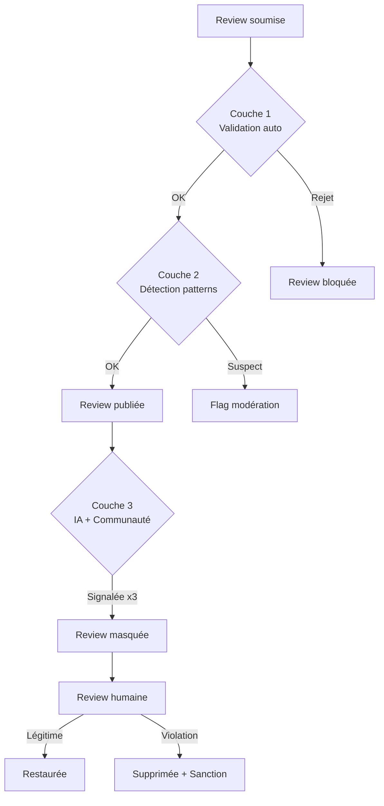

# Sécurité & Anti-triche

La crédibilité du système de progression repose entièrement sur l'intégrité des données. Si le système peut être trompé, la méritocratie s'effondre.

## Défenses en couches



## Anti-fake Reviews

### Couche 1 : Validation automatique (MVP)

| Vérification | Mécanisme | Action |
|--------------|-----------|--------|
| Géolocalisation | GPS < 100m du restaurant | Rejet si trop loin |
| Cooldown | 1 review/restaurant/24h | Rejet si doublon |
| Rate limit | Max 10 reviews/jour | Blocage temporaire |
| Photo EXIF | Vérification date/lieu metadata | Flag si incohérent |
| Velocity | Trop d'actions trop vite après inscription | Flag + review manuelle |
| Cohérence | User note toujours 5/5 | Coefficient de confiance réduit |

### Couche 2 : Détection de patterns (Phase 2)

**Device fingerprinting :**
- Expo Device API : deviceId, deviceName, modelName, osVersion
- Détection multi-comptes sur le même device
- Pas de blocage automatique, mais flag pour investigation

**Analyse comportementale :**
- Temps passé sur la page review (< 10sec = suspect)
- Pattern de notation (toujours même score = suspect)
- Ratio likes reçus / reviews postées (anomalies)
- Horaires d'activité (reviews à 3h du matin = suspect)

**Network analysis :**
- Groupes de comptes qui se likent mutuellement
- Comptes créés depuis la même IP
- Patterns d'inscription coordonnés

### Couche 3 : IA (Phase 3)

- Détection texte généré (reviews ChatGPT/copier-coller)
- Détection photos volées (reverse image search simplifié)
- Score de confiance par user basé sur machine learning
- Détection de rings de fake reviews

## Anti-abus Points

| Protection | Mécanisme |
|------------|-----------|
| Cap journalier | 500 points max/jour par hunter |
| Cap clan | 500 points clan/jour |
| Vérification GPS groupe | Tous les participants d'un hunt groupe doivent être géolocalisés |
| Audit trail | Chaque attribution de points est tracée (user, action, points, raison, timestamp) |
| Dégradation | Si fraude prouvée : retrait de points + possible downgrade de niveau |
| Cooldown clan | 7 jours avant de pouvoir rejoindre un nouveau clan après avoir quitté |

## Sécurité Applicative

### Authentification & Sessions
- Sessions httpOnly + secure + sameSite (Better Auth)
- Rate limit login : 5 tentatives/15min par IP + par email
- Session rotation après login
- Multi-device : liste des sessions actives + révocation individuelle

### Input Validation
- Zod sur toutes les entrées tRPC (validation côté serveur)
- Taille max des champs texte (reviews : 5000 chars, descriptions : 2000 chars)
- Sanitization HTML (pas de HTML dans les reviews)
- Validation des URLs (photos, liens)

### Protection contre les attaques classiques
- **SQL Injection** : Drizzle ORM (parameterized queries, aucune query raw sauf exception auditée)
- **XSS** : React escape par défaut + Content Security Policy headers
- **CSRF** : Token synchronizer (Better Auth)
- **CORS** : Strictement limité aux domaines autorisés (`huntasty.app`, scheme mobile)
- **File upload** : Validation MIME type + taille max 10MB + pas d'exécution
- **Rate limiting** : Redis-based, par IP + par user + par endpoint

### API Security
- API keys serveur-side uniquement (jamais dans le bundle client)
- Stripe webhook signature verification
- tRPC context : vérification session sur chaque procedure protégée
- Pas de données sensibles dans les URLs (query params)

### Infrastructure
- Cloudflare WAF : protection DDoS basique (gratuit)
- Nginx : rate limiting additionnel, headers sécurité
- Docker : containers isolés, pas de root
- PostgreSQL : user dédié avec permissions minimales
- Redis : pas d'accès externe (bind 127.0.0.1 / réseau Docker interne)

## Conformité Légale

### RGPD (Union Européenne)

Applicable pour les users français et européens.

| Obligation | Implémentation |
|------------|----------------|
| Consentement | Checkbox explicite à l'inscription |
| Droit d'accès | Endpoint API : export JSON de toutes les données personnelles |
| Droit de rectification | Modification profil depuis l'app |
| Droit à l'effacement | Suppression compte (soft delete 30j → hard delete) |
| Portabilité | Export au format JSON standard |
| Minimisation | Ne collecter que les données nécessaires |
| Sécurité | Chiffrement en transit (TLS), hashing mots de passe (bcrypt) |

### APPI (Japon)

Act on Protection of Personal Information - applicable pour tous les users au Japon.

| Obligation | Implémentation |
|------------|----------------|
| Notice d'utilisation | Politique de confidentialité en japonais |
| Consentement avant partage | Opt-in explicite pour chaque type de partage |
| Sécurité des données | Mesures techniques et organisationnelles |
| Notification de breach | Procédure documentée (72h vers PPC) |
| Transfert transfrontalier | Consentement explicite si données envoyées hors Japon |

### Points d'attention spécifiques

**Géolocalisation :**
- Opt-in explicite pour la collecte GPS
- Utilisation limitée : check-in et nearby uniquement
- Pas de tracking continu en arrière-plan
- L'utilisateur peut désactiver à tout moment

**Photos :**
- Les photos de plats sont publiques par défaut (avec consentement)
- Pas de reconnaissance faciale
- EXIF strippé après validation (pas de leak de données GPS des photos)

**Reviews :**
- Les reviews sont publiques et liées au profil
- L'utilisateur peut supprimer ses reviews
- En cas de suppression de compte : reviews anonymisées (auteur = "Ancien Hunter")

## Modération

### Contenu signalé

```
Signalement par un user
    │
    ├── 1 signalement → Enregistré, pas d'action
    ├── 3 signalements → Review masquée automatiquement
    │                     → Notification au modérateur
    └── Modérateur décide :
        ├── Légitime → Review restaurée
        ├── Violation mineure → Warning au user
        ├── Violation grave → Review supprimée + warning
        └── Récidive → Suspension temporaire (7j/30j/permanent)
```

### Types de violations

| Type | Exemples | Sanction |
|------|----------|----------|
| Spam | Reviews copiées-collées, contenu promotionnel | Warning → Suspension |
| Fake | Avis sans avoir visité le restaurant | Retrait points + suspension |
| Harcèlement | Attaques personnelles envers staff | Suspension immédiate |
| Contenu inapproprié | Photos non liées à la nourriture | Suppression + warning |
| Manipulation | Rings de likes, multi-comptes | Ban permanent |
